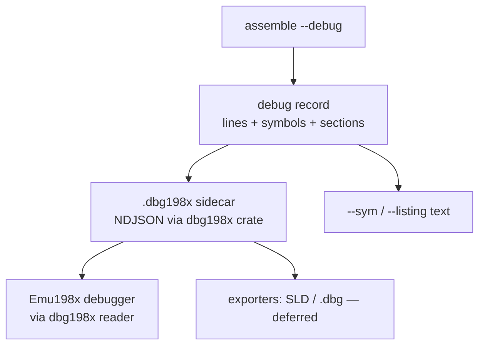
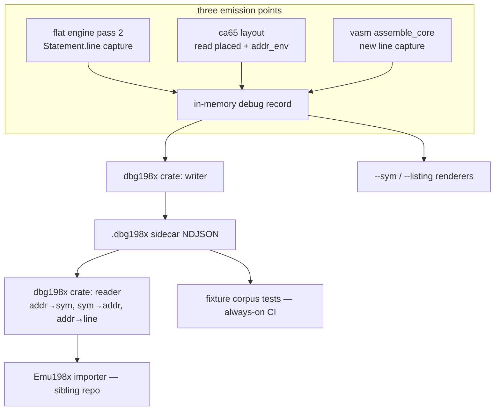

# Cross-CPU Debug-Info Format - Plan

## Goal Capsule

- **Objective:** Define and emit **dbg198x** — one machine-readable debug-info format (line↔address map, symbols, sections, address-space info) — uniformly for every CPU Asm198x assembles, so the 198x family (Emu198x first) gets source-level debugging from a single importer.
- **Product authority:** Steve Hill. Seeded from the ideation record at `docs/ideation/2026-07-03-asm198x-world-class-ideation.html` (idea 1); scope questions resolved in dialogue 2026-07-03; requirements pressure-tested by document review the same day (nine findings applied).
- **Open blockers:** None for planning. One precondition for implementation: the Emu198x importer commitment named in Dependencies (milestone-standing, not mere issue existence) must be in place before implementation starts.

---

## Product Contract

### Summary

Asm198x gains a `--debug=<file>` flag that writes a `.dbg198x` sidecar — NDJSON, one record per line — identical in shape across all 19+ CPUs. `--sym` and `--listing` become human-readable renderings of the same data. A new `dbg198x` crate in the workspace owns the format (types, writer, reader); Emu198x consumes the reader for symbolized disassembly and source-level breakpoints. The spec is public from day one in draft status; the v1 freeze fires at first real consumption. Exporters to existing formats (sjasmplus SLD, ca65 `.dbg`) are a later stage.

### Problem Frame

No cross-assembler debug-info standard exists in retro tooling. Each incumbent assembler grew its own single-tool format (sjasmplus SLD, ca65 `.dbg`, WLA-DX `.sym`), each emulator writes bespoke importers, and two consumers even disagree about what the `.dbg` extension means. Inside the family, Emu198x's planned consumption of assembler output for debug views is not yet wired, and debugging today means reading raw hex against a source file by hand.

Asm198x already computes the data: the engine tracks a source line per `Statement` through both passes (`Statement.line`, `crates/asm198x/src/engine.rs:319-323`) and resolves every symbol (`Assembly.symbols`, `engine.rs:20-36`), but exposes none of it — no symbol file, no listing, no map output exists. The gap is emission and format, not computation.

### Key Decisions

- **Native schema first; exporters later.** The primary format is Asm198x's own, designed for cross-CPU uniformity. Emitting sjasmplus SLD or ca65 `.dbg` as the primary format was rejected: each encodes one tool's single-CPU assumptions, and squatting another tool's format identity repeats the `.dbg` ambiguity mistake. DWARF was also considered as the existing cross-CPU standard and rejected — a binary format with heavy tooling requirements, no retro emulator consumes it, and its compilation-unit/object model fits linked-object toolchains (llvm-mos), not the fused single-source image this format describes. Exporters deliver their day-one-compatibility value as a deferred stage instead.
- **Identity: `dbg198x`, extension `.dbg198x`.** One name everywhere — the header's format field, the file extension, the crate, the spec page. Chosen over terser `.d198x` (less obviously "debug" to someone finding the file cold) and over an unbranded community name (weaker tie to the toolchain that guarantees it). Unambiguity over brevity is deliberate: `.dbg` already means two things in the wild, and `.adf` collides with Amiga Disk File.
- **Serialization: NDJSON.** One JSON record per line, discriminated by a `t` field. Every consumer already has a parser (serde/jq/JS), records grep and diff line-stably, and new record types land without breaking readers — the additive-evolution property R11 requires. Chosen over SLD-style delimited text (every consumer hand-rolls a parser; nested data strains it) and a single JSON document (noisy diffs, full-parse required).
- **The format gets its own crate: `dbg198x`.** Types + writer + reader in a new workspace crate; `asm198x` depends on it to write, Emu198x depends on it alone to read — the same neutral footing as `isa-disasm`, and the "Emu198x actually consumes it" promotion trigger from the standing decisions arriving. The format is a data contract, not ISA data, so it does not live in `isa` (which would churn the format crate every time a CPU lands). The wider promotion — moving `isa`/`isa-disasm` out of the workspace or into separate repos — is explicitly not taken; crates.io publication from the existing workspace covers the public surface when Emu198x wires up.
- **Sidecar file, never image bytes.** Debug info is a separate output file; the assembled image is byte-identical with or without `--debug`. This keeps the byte-identical validation story untouched and stays consistent with the existing loadable-image-parity decision that deliberately omits vasm's `HUNK_SYMBOL` table from the hunk image (`decisions/syntax-stance.md`) — that decision governs image bytes and is unaffected by a sidecar.
- **One format across both assembly drivers.** The flat engine and the two bypass paths (vasm multi-section, ca65 linker) all emit the same format. The bypass paths carry their own section/symbol structures today (`dialects/vasm.rs:237-246` `SecOut`/`sec_of`; `dialects/ca65.rs:35-62` the `NES_SEGMENTS` table, `:103` the `label_seg` label→segment map, and `:131-162` the layout pass whose `placed` vector carries segment, absolute address, and source line per statement), so each needs its own emission point — accepted cost, because a format that only covers the flat engine excludes the Amiga and NES, two flagship targets.
- **Public from day one, frozen at first consumption.** The spec is published in the org `docs` repo, written for external implementers, with a conformance fixture set — but it carries explicit **draft status (v0.x, "subject to change until the first consumer ships")**. The v1 freeze, and with it R11's additive-evolution guarantee, is a gated event executed via a **freeze decision-record checklist**: (1) first consumption has occurred — primarily the `dbg198x` reader exercised end-to-end by Emu198x for symbolized disassembly and breakpoints; secondarily, by explicit decision-record event at the bounded review named in Dependencies, the maintainer's own dev-loop consumption plus a reference reader exercising all R9 lookups against the fixture corpus may qualify as first consumer; (2) fixtures cover every CPU family the first consumers exercised, with any uncovered families named and their risk accepted per family; (3) the banked fixture has passed R10's three validation exercises. Real consumers routinely falsify format designs; the irreversible promise waits for that first contact while the public posture starts immediately. Format evolution is governed by a decision record in `decisions/`. The door to editor stepping (a DeZog-style DAP adapter) stays open by design: R4's address-space rigor is in the format from v0, so that adapter is a later exporter, never a format break.

### Requirements

**Format content**

- R1. The format carries a line↔address map: for each emitted byte range, the source file and line that produced it.
- R2. The format carries the full symbol table: name, value, and kind (label, equ/constant, entry point). Address-valued kinds (label, entry point) carry the same address-space qualifier as line-map records (R4); constant kinds explicitly carry none — a bank-`$7E` label and a constant sharing its low 16 bits must be distinguishable to the R9 lookups.
- R3. The format carries section/segment records where the producing path has them (vasm hunks, ca65 segments); flat-engine output is a single implicit section.
- R4. Every address record carries an address-space qualifier, specified with full rigor from v0. Address fields are u64-capable by spec (NDJSON numbers are width-free; readers use u64). Shipping populated: flat 16-bit, and the 65816's 24-bit form filled from actual placement — bank 0 today, since the engine places all code within 64K. The banked/paged shape (Spectrum 128 slots, NES mappers) is defined in the spec now and populated when a machine needs it — no format break later.
- R5. The file identifies itself: a header record with format name (`dbg198x`), format version, producing tool + version, target CPU, dialect, and source file(s).

**Emission**

- R6. `--debug=<file>` works for every CPU and dialect, including the vasm and ca65 bypass paths.
- R7. Emitting debug info never changes the assembled image bytes.
- R8. `--sym` (name = value list) and `--listing` (address, bytes, source line) are renderings derived from the same data as R1-R5, not independent code paths.

**Consumption**

- R9. The `dbg198x` crate ships the format's types, writer, and reader; Emu198x can depend on it alone (no parser, engine, or dialects) and resolve address→symbol, symbol→address, and address→source-line lookups — enough for symbolized disassembly and source-anchored breakpoints. (The Emu198x importer itself is sibling-repo work; see Dependencies.)
- R10. The format ships with a written spec in the org `docs` repo (draft v0.x until the freeze — see Key Decisions) and a conformance fixture set (sample source + expected `.dbg198x` output). The v0 fixture set covers the CPU families the first consumers actually exercise — the Emu198x-supported families plus the maintainer's active dev-loop targets. Additional families gain fixtures incrementally as consumers reach them; this growth is independent of the v1 freeze (full coverage is a post-freeze goal — fixtures are additive under R11), and the freeze checklist names and accepts any per-family gaps. The set includes at least one hand-authored banked fixture (a Spectrum 128 paged program with expected output), validated three ways before the freeze even though no emission path populates it yet: reader tests resolve R9's address→symbol and address→source-line lookups across two banks of the fixture (exercised as data, not merely parsed); a desk exercise maps every banked record onto sjasmplus SLD long addresses (no exporter code required); and the fixture's slot/bank expectations are cross-checked against Emu198x's actual Spectrum 128 paging model.
- R11. From the v1 freeze onward, format evolution is additive within a major version — new record types must not break v1 readers; a version bump is a decision-record event; facts never silently change meaning. Before the freeze (draft v0.x), the format may change shape, with changes recorded in the spec's changelog.

### Success Criteria

- **Tier 1 — this repo alone:** the `dbg198x` crate, `--debug`/`--sym`/`--listing`, the draft spec page, and the v0 fixture set ship and pass conformance (AE1-AE6 as applicable in-repo).
- **Tier 2 — the family outcome:** F1 works end-to-end in Emu198x (symbolized disassembly + source-anchored breakpoints), contingent on the Emu198x importer milestone named in Dependencies. The v1 freeze fires here, not at Tier 1 — executed via the freeze decision-record checklist in Key Decisions (first consumption, fixture coverage or named accepted gaps, banked-fixture validation).

### Key Flows

- F1. Source-level debugging in the family
  - **Trigger:** Developer assembles a program with `--debug`.
  - **Steps:** Asm198x writes image + `.dbg198x` sidecar; Emu198x loads both; the debug view renders `jsr init` instead of `jsr $c012`; a breakpoint set on a source line resolves to its address; hitting it highlights the source line.
  - **Outcome:** The first source-level debugging experience that works identically for a C64, Spectrum, Amiga, or PDP-11 program.
- F2. Human artifacts without a debugger
  - **Trigger:** Developer (or a Code198x lesson build) passes `--sym`/`--listing`.
  - **Steps:** Same internal data renders as text; the listing shows address, bytes, and source per line.
  - **Outcome:** Teaching-grade output and a diffable artifact, no emulator required.

### Acceptance Examples

- AE1. **Covers R1, R9.** Given a C64 lesson program with label `init` at `$c012`, when assembled with `--debug` and loaded via the `dbg198x` reader, then disassembly at `$c012` can render `init` and a breakpoint on the defining source line resolves to `$c012`.
- AE2. **Covers R7.** Given any program in the conformance corpus, the image bytes with `--debug` are identical to the bytes without it.
- AE3. **Covers R4.** Given a 65816 program, line-map records carry the 24-bit address form populated from actual placement (bank 0 under today's 64K engine model), and a flat-CPU file (Z80) carries plain 16-bit addresses without fabricated bank data. A bank-`$7E` fixture becomes buildable once the Tier-2 engine widening lands (see Dependencies); until then the banked *shape* is validated by R10's hand-authored Spectrum 128 fixture.
- AE4. **Covers R6, R3.** Given an Amiga program built via the vasm path with two sections, the sidecar lists both sections and attributes each byte range to the right one.
- AE5. **Covers R11.** Given a v1 reader and a file containing an unknown record type, the reader skips it and still resolves every AE1 lookup.
- AE6. **Covers R6, R3, R1.** Given an NES program built via the ca65 path with code and data segments, the sidecar lists both segments, and a label placed by the linker resolves to its post-link ROM address in both the line map and the symbol table.

### Scope Boundaries

**Deferred for later**

- Compatibility exporters (sjasmplus SLD for DeZog/CSpect, ca65 `.dbg` for Mesen2) — high adoption value, but they only make sense once the native format is stable.
- An editor debug-adapter (DeZog-style DAP) and any Forge198x work — the door is held open by R4/R11; the work is not v1.
- Populating banked/paged address semantics beyond the 65816 bank byte — the shape is specified and fixture-validated per R4/R10; emission-path population waits for a machine that needs it.
- Scope/visibility records (local labels, macro expansion frames) — macros and engine-level local labels do not exist yet; the format gains these record types additively when the language surface does.
- crates.io publication of `dbg198x` (and siblings) — with the Emu198x wiring, not before.

**Outside this product's identity**

- The debugger UI itself — Emu198x and Forge198x own presentation; Asm198x owns the data.
- Relocatable/object-file debug info — linking stays fused per the standing packaging decision (`decisions/packaging-and-cpu-roadmap.md` §3); this format describes a fully-linked image.
- Moving `isa`/`isa-disasm` to separate repos — rejected for now; the format crate is the extraction this feature justifies.

### Dependencies / Assumptions

- Engine capability verified in-repo: per-statement `line` exists through both passes (`Statement.line`, `crates/asm198x/src/engine.rs:319-323`, re-verified 2026-07-03 round 2); recording line→address during pass 2 is new plumbing, not a redesign. Note: `engine.rs` is churning under same-day CP1610 work — cite symbol names alongside line anchors, and re-verify anchors at plan time.
- The vasm and ca65 paths bypass the flat engine and need their own emission (`crates/asm198x/src/dialects/vasm.rs:237-246` `SecOut`/`sec_of`; `crates/asm198x/src/dialects/ca65.rs:103` `label_seg`, `:131-162` the layout pass — its `placed` vector and `addr_env` already hold segment, post-link address, and source line per statement).
- **Engine address-width limit, and the widening that lifts it:** the flat engine places code within 64K (`Assembly.origin: u16` at engine.rs:22; the org clamp at :381-382 and :435; the "program exceeds the 64K address space" check at :643-644). The format is u64-capable regardless (R4), but real bank-`$7E`/32-bit fixtures require the roadmap's Tier-2 widening (origin/PC/image model u16→u32) — its own change with its own blast radius, sequenced at planning, not bundled silently into this feature.
- **Precondition before implementation starts — satisfied 2026-07-03:** the dbg198x importer is accepted onto the Emu198x milestone **"dbg198x importer"** (emu198x/emu198x milestone #29, issue emu198x/emu198x#741; this plan tracked as asm198x/asm198x#55). Tier 2 of Success Criteria and the v1 freeze remain contingent on that milestone's delivery.
- **Bounded review:** if Emu198x consumption has not begun within one quarter of Tier 1 shipping, the freeze gate (including the secondary first-consumer trigger in Key Decisions), and the deferred exporter/crates.io queue, are re-examined in a decision record — the draft state has a bounded review, never an open-ended wait.
- v1 consumer priority confirmed 2026-07-03: Emu198x + the maintainer's own dev loop first; editor stepping and exporters deferred but designed-for.

### Outstanding Questions

**Deferred to planning**

- Exact record vocabulary (`t` types), field names, and number encoding (decimal ints vs hex strings) — settled when the spec page is drafted.
- Exact emission points in the engine and both bypass paths; how `--listing` shares the disassembler's rendering.
- Conformance fixture layout and how AE2 (byte-identity) hooks into the existing test tiers.
- Whether the `dbg198x` crate hand-rolls NDJSON or takes a serde dependency — including who owns correct JSON string escaping for symbol names and source paths (weigh against the crate's neutral-footing goal).
- Whether Forge198x consumes `dbg198x` directly or only via Emu198x — affects how soon scope/macro record types are needed.

(The SLD long-address projection check formerly deferred to the exporter stage is now a pre-freeze R10 exercise.)

### Sources

- `docs/ideation/2026-07-03-asm198x-world-class-ideation.html` — idea 1, with basis and verifier verdicts.
- Grounding scout (2026-07-03, anchors refreshed in round-2 review): engine line tracking (`Statement.line`, engine.rs:319-323), 65816 bank handling (`Expr::Bank`, engine.rs:134-135), bypass-path structures (vasm.rs:237-246; ca65.rs:103, :131-162), CLI output dispatch (main.rs:189-221).
- `decisions/syntax-stance.md` — the HUNK_SYMBOL omission (loadable-image parity) this format must stay consistent with.
- External prior art: sjasmplus SLD (long addresses, DeZog/CSpect), ca65 `.dbg` (Mesen2), the FCEUX/Mesen2 `.dbg` extension collision, and DWARF (considered and rejected — see Key Decisions).
- Plan-time recon (2026-07-03): entry-point shapes (`crates/asm198x/src/lib.rs:64-142` — flat dialects return `Assembly`; ca65/vasm return bare `Vec<u8>`), the pass-2 emission loop (`engine.rs:414-451`, `pc = origin + bytes.len()` at :421), CLI flag threading (`main.rs:189-230`, output dispatch :310-406), ca65 `placed`/`addr_env` (ca65.rs:134-138), vasm `assemble_with`/`assemble_exe`/`SecOut` (vasm.rs:197-246 — **no line data in `SecOut`**; vasm needs capture threaded through `assemble_core`).

---

## Planning Contract

**Product Contract preservation:** unchanged — all R/AE IDs and text carried verbatim from the reviewed requirements state.

### Key Technical Decisions

- **KTD1 — `dbg198x` depends on `serde` + `serde_json`, nothing else, and never on `asm198x`.** The dependency direction is asm198x → dbg198x (writer) and Emu198x → dbg198x (reader); a reverse dependency would be circular. Serde is the boring Rust standard: it solves JSON string escaping (symbol names, source paths) outright and gives unknown-record tolerance naturally. The `isa` crate's zero-dependency stance is a spec-data policy, not a family-wide rule; a data-contract crate warrants the ecosystem serializer. (Confirmed in scoping synthesis 2026-07-03.)
- **KTD2 — Capture once, render three ways.** Pass 2 builds an in-memory debug record (header identity, sections, symbols with kind + address-space qualifier, line→byte-range spans); it lands on `Assembly` as a new **additive field**, so none of the ~26 `assemble_*` signatures change. `--debug` serializes it via `dbg198x`; `--sym` and `--listing` are text renderings of the same record (R8). Lines that emit no bytes render in listings from source text with an empty address column — they need no format records.
- **KTD3 — Numbers are decimal JSON integers in the format; hex is a rendering concern.** JSON-native, lossless to u64 (R4), and consumers get parsing for free. Listings render hex. The record vocabulary (`t` values, field names) is settled in U7's spec page — one source of truth, not scattered across units.
- **KTD4 — Bypass paths emit from existing post-layout data via new entry variants.** ca65: read `placed` (segment, absolute address, source line) and `addr_env` after layout — a read-out, no recomputation. vasm: `SecOut` carries no line data, so per-statement (section, byte-offset, length, line) capture is threaded through `assemble_core` — the accepted-cost decision, and the riskiest emitter (see U5's execution note). Both paths gain `*_debug` entry variants; existing signatures stay untouched.
- **KTD5 — Address-space qualifier is an optional field, absent = flat.** Flat CPUs emit nothing extra (AE3's no-fabricated-bank clause); the 65816 emits its 24-bit form from actual placement; the banked/paged shape (slot/page fields) is defined in the U7 spec and exercised only by U6's hand-authored fixture until a machine populates it.
- **KTD6 — Fixtures are always-on tests.** The v0 corpus (source + expected `.dbg198x` per family) lives in the asm198x test tree and runs without reference assemblers, so CI enforces the format from day one — unlike the `#[ignore]`d reference-arbitrated suites.
- **KTD7 — Addresses are (section, offset) pairs; absolute is the degenerate case.** Every address-bearing record carries a section id and a section-relative offset. Flat and linked-absolute targets (engine paths, ca65 post-link) have one section whose base is the absolute address, so their records read as absolute with zero ceremony. Relocatable output (vasm hunks) keeps section-relative offsets, and the reader's lookups accept an optional per-section base map — Emu198x supplies actual hunk load addresses at import time; fixtures use a documented synthetic base. Same design instinct as SLD's long addresses: qualify the address rather than pretend the world is flat.

### High-Level Technical Design

### Assumptions

- vasm line capture is passive: it records what emission already does and cannot alter bytes; the U5 characterization differential enforces this rather than trusting it.
- v0 fixture families (confirmed 2026-07-03): Spectrum/Z80, C64/6502 (acme), NES/6502 (ca65 path), Amiga/68000 (vasm path), one 65816 sample for the 24-bit form, plus the hand-authored Spectrum 128 banked fixture.
- The spec page unit writes into the org `docs` repo (a sibling git repo in the container); commits there are separate from this repo's commits.

### Sequencing

U1 → U2 → U3 → U4 → U5 → U6 → U7. The format crate leads (everything consumes it); the vasm emitter is deliberately last of the three emission points so the pattern is proven twice before the riskiest path; fixtures land once all three paths emit; the spec page freezes vocabulary last, informed by everything learned.

---

## Implementation Units

### U1. The dbg198x format crate

- **Goal:** A standalone crate owning the format — record types, NDJSON writer, reader with lookups.
- **Requirements:** R2, R4, R5, R9, R11 (AE5).
- **Dependencies:** none.
- **Files:** `Cargo.toml` (workspace members), `crates/dbg198x/Cargo.toml`, `crates/dbg198x/src/lib.rs`, `crates/dbg198x/CHANGELOG.md`, `release-plz.toml`.
- **Approach:** Typed records (header, section, symbol, line-span) with a `t` discriminator; writer emits one JSON object per line; reader parses into a `DebugInfo` whose lookups are keyed per KTD7 — `symbol_at`, `addr_of`, `line_at` over (section, offset), with an optional per-section base map collapsing to plain absolute addresses for single-section files. Unknown `t` values are skipped, not errors (AE5/R11). Address-valued symbol kinds carry the space qualifier; constants don't (R2). Serde per KTD1. Release plumbing follows the isa/isa-disasm precedent: `release-plz.toml` gains a `[[package]] name = "dbg198x"` entry with `git_tag_enable = false` (a version tag with no binary makes cargo-dist emit a junk GitHub Release — the repo already hit this once with isa-disasm), and the asm198x dependency is declared `dbg198x = { path = "../dbg198x", version = "<workspace>" }` so release-plz's `cargo package` verification passes.
- **Execution note:** Test-first on the reader lookups — they are the consumer contract Emu198x builds against.
- **Test scenarios:** writer/reader round-trip preserves every field; `Covers AE5.` unknown record type is skipped and lookups still resolve; symbol name containing quotes/backslash/non-ASCII survives round-trip; label vs constant with equal values are distinguishable via kind + qualifier; address at u64 boundary round-trips; empty program produces header-only file that parses; two-section synthetic file — lookups resolve section-relative without a base map and as rebased absolutes with one.
- **Verification:** `cargo test -p dbg198x` green; crate builds with only serde/serde_json in its tree.

### U2. Engine debug capture

- **Goal:** Pass 2 records line→address spans and typed symbols onto `Assembly` without changing any signature or output byte.
- **Requirements:** R1, R2, R7.
- **Dependencies:** U1.
- **Files:** `crates/asm198x/src/engine.rs`, `crates/asm198x/src/lib.rs` (re-exports).
- **Approach:** New additive `Assembly` field holding the debug record. In the pass-2 loop, snapshot `pc` and byte-length before/after each statement (`engine.rs:421` context) and record a span when bytes grew; classify symbols at definition (label / equ-constant / entry). Flat single implicit section (R3). **Padding rule:** `org`-gap and `align` fill bytes produce no line span — `line_at()` over pad addresses returns nothing, listings render fills without source attribution (carried into U7's spec text).
- **Test scenarios:** instruction, data directives, and label/entry symbols capture correctly; `equ` yields constant kind and no span; `org` gap and `align` fill yield no line spans (the padding rule); a label and an equ of equal value carry different kinds; `Covers AE2.` bytes with capture enabled are identical to before this unit (assert against existing fixtures).
- **Verification:** full existing test suite untouched and green — any byte or API diff is a defect.

### U3. CLI flags and text renderings

- **Goal:** `--debug[=path]`, `--sym`, `--listing` for every flat-engine dialect, rendering from U2's record.
- **Requirements:** R6 (flat paths), R8; F2.
- **Dependencies:** U2.
- **Files:** `crates/asm198x/src/main.rs`, `crates/asm198x/src/listing.rs` (new), `crates/asm198x/src/lib.rs`.
- **Approach:** Parse flags in the arg loop (`main.rs:189-230` pattern); default sidecar path = input with `.dbg198x` extension; render sym (`name = $hex` sorted) and listing (address, bytes, source) from the shared record per KTD2; update `usage()`.
- **Test scenarios:** each flag produces its artifact for a Z80 and a 6502 program; `--debug` alongside `--sna`/`--prg` emits both artifacts; listing shows equ/comment lines with empty address column; sidecar default naming; `Covers AE2.` image bytes identical with and without flags.
- **Verification:** golden-file tests for sym/listing; manual smoke on one curriculum program.

### U4. ca65 path emission

- **Goal:** The NES/ca65 linker path emits the same format from its post-layout data.
- **Requirements:** R3, R6; AE6.
- **Dependencies:** U1, U3 (the CLI `--debug` flag surface U4 wires into).
- **Files:** `crates/asm198x/src/dialects/ca65.rs`, `crates/asm198x/src/lib.rs`, `crates/asm198x/src/main.rs`.
- **Approach:** After layout, read `placed` (ca65.rs:138 — segment, absolute address, source line) and `addr_env` into the debug record; segment records from `NES_SEGMENTS`; expose via a `*_debug` entry variant per KTD4. Addresses are post-link CPU addresses (what debuggers need), not file offsets.
- **Test scenarios:** `Covers AE6.` two-segment NES program: both segments listed, linker-placed label resolves to post-link address in line map and symbol table; `Covers AE2.` `.nes` bytes identical with and without `--debug`; constants from `addr_env` carry constant kind.
- **Verification:** AE6 test green; existing ca65 curriculum tests untouched.

### U5. vasm path emission

- **Goal:** The Amiga/vasm path emits the format, with line capture threaded through `assemble_core`.
- **Requirements:** R3, R6; AE4.
- **Dependencies:** U1; sequenced after U3 and U4 deliberately.
- **Files:** `crates/asm198x/src/dialects/vasm.rs`, `crates/asm198x/src/lib.rs`, `crates/asm198x/src/main.rs`.
- **Approach:** Extend `assemble_core` to record (section index, byte offset, length, source line) per emitted statement alongside `SecOut`; symbols from the existing section/label maps; multi-section records per hunk, section-relative per KTD7 (no fabricated absolutes — the reader's base map owns rebasing). Watch the hidden align pad byte at `vasm.rs:351-353`: it is emission the capture must not mis-attribute (padding rule applies). Capture is strictly passive — it observes emission, never branches on it.
- **Execution note:** Characterization first — before touching `assemble_core`, snapshot byte output across the full vasm corpus (curriculum + sweep samples, flat and hunk-exe); after the change, diff. Any byte difference is a stop-and-revert signal, not a thing to debug forward through. This is the riskiest emitter; it is separable to a fast-follow if it fights back, but it is in scope — the format isn't credible without the Amiga.
- **Test scenarios:** `Covers AE4.` two-section program: both sections in the sidecar, byte ranges attributed correctly; `Covers AE2.` flat and hunk-exe outputs byte-identical pre/post capture across the corpus; label in section 1 referenced from section 0 resolves.
- **Verification:** the characterization diff is empty; AE4 test green.

### U6. Conformance fixture corpus

- **Goal:** The v0 fixture set — always-on tests enforcing the format across first-consumer families, including the banked fixture's validation legs.
- **Requirements:** R10; AE1, AE2, AE3, AE5 exercised corpus-wide.
- **Dependencies:** U3, U4, U5.
- **Files:** `crates/asm198x/tests/dbg198x_fixtures.rs` (new, always-on), `crates/asm198x/tests/fixtures/dbg198x/` (per-family source + expected sidecar: z80-spectrum, 6502-c64, 6502-nes, 68000-amiga, 65816 24-bit sample, spectrum128-banked).
- **Approach:** Each fixture asserts exact expected sidecar plus reader-lookup behavior; the comparison normalizes the producing-tool version field (the writer accepts an injectable version for tests) so expected sidecars stay byte-stable across release bumps — only the format version is asserted exactly. The corpus-wide AE2 check asserts image bytes match the no-debug build. The hand-authored Spectrum 128 fixture gets cross-bank `line_at`/`symbol_at` lookup tests (leg 1) and an SLD long-address projection table committed alongside it (leg 2); leg 3 (Emu198x paging cross-check) is a freeze-checklist item, cross-repo, tracked in the Definition of Done — not automatable here.
- **Test scenarios:** per family — `Covers AE1.` label lookup and line→address resolution; `Covers AE3.` 65816 records carry the 24-bit form, Z80 records carry no space qualifier; `Covers AE2.` corpus byte-identity; banked fixture — same low-16-bit address in two banks resolves to two distinct symbols/lines.
- **Verification:** `cargo test --workspace` runs the whole corpus with no reference tools installed; coverage gate stays ≥60%.

### U7. Spec page and format decision record

- **Goal:** The public draft-v0 spec and the format's governing decision record.
- **Requirements:** R5 vocabulary, R10 spec, R11 evolution policy.
- **Dependencies:** U1-U6 (vocabulary freezes last, informed by all emitters).
- **Files:** org docs repo (sibling): `dbg198x.md` (spec: identity, record vocabulary and `t` types, field tables, decimal encoding, the KTD7 section/offset addressing model and base-map rebasing, address-space shapes incl. banked, the padding rule, draft-v0 banner, changelog, SLD projection notes); this repo: `decisions/dbg198x-format.md` (evolution policy, freeze decision-record checklist template — first consumption incl. the secondary trigger, per-family fixture coverage or named accepted gaps, banked-fixture legs — and the bounded-review trigger).
- **Approach:** Spec written for external implementers against U6's fixtures ("implement an importer from this page plus these fixtures, without reading Asm198x source" — R10's test). Vale/House198x lint applies. Target repo declared per cross-repo convention; commits land in each repo separately.
- **Test expectation:** none — documentation; the fixtures are its executable half.
- **Verification:** an importer-shaped read-through against a fixture file finds no undocumented field; decision record cross-references the packaging and syntax-stance records.

---

## Verification Contract

| Gate | Command | Applies |
|------|---------|---------|
| Workspace tests (incl. new always-on fixture corpus) | `cargo test --workspace` | every unit |
| Lint gates | `cargo clippy --workspace -- -D warnings` · `cargo fmt --check` | every unit |
| Coverage floor | `scripts/coverage.sh` + `scripts/coverage-gate.sh` (≥60%) | every unit |
| Byte purity (AE2) | corpus byte-identity test in `dbg198x_fixtures.rs`; U5's characterization diff | U2-U6 |
| Reference-arbitrated suites unaffected | `cargo test -- --ignored` where tools installed (local) | spot-check after U5 |

Definition-of-ready for each unit's completion: its `Covers AE<N>` scenarios pass, and no existing test changed behavior.

---

## Definition of Done

- U1-U7 landed; all Verification Contract gates green in CI.
- AE1-AE6 each realized as at least one passing always-on test (AE1 via the `dbg198x` reader; AE3 in its bank-0 form per R4).
- The spec page is live in the org docs repo with the draft-v0 banner; `decisions/dbg198x-format.md` merged with the freeze checklist and bounded-review trigger.
- **Gate (precondition, not a unit):** the Emu198x importer commitment (milestone-standing per Dependencies) exists before U1 implementation begins — aligned with the Goal Capsule's unqualified "before implementation starts".
- Cross-repo freeze-checklist items (Emu198x paging cross-check of the banked fixture; first-consumption event) are recorded in the decision record as pending — they gate the v1 freeze, not this plan's done.
- No abandoned experimental code in the diff; conventional-commit messages per repo convention (release-plz consumes them).
