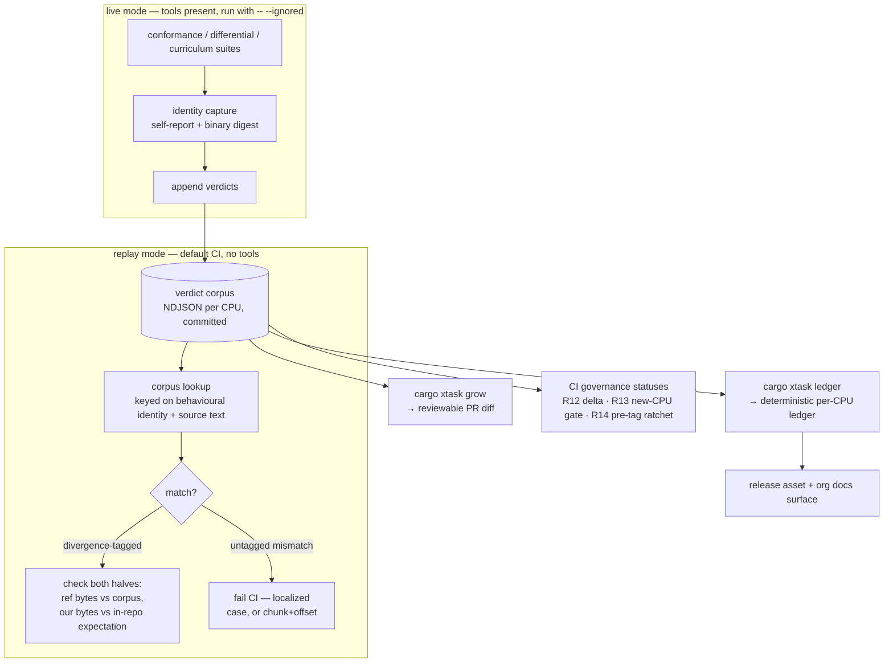

# Verdict Pipeline - Plan

## Goal Capsule

- **Objective:** Make the byte-identical guarantee enforceable and visible without the reference tools: a committed **reference-verdict corpus** that CI and contributors replay against, and a per-release public **conformance ledger** generated from it.
- **Product authority:** Steve Hill. Seeded from the ideation record at `docs/ideation/2026-07-03-asm198x-world-class-ideation.html` (idea 2); scope confirmed 2026-07-03; pressure-tested by document review the same day (nine findings applied; two judgment calls returned to Steve).
- **Open blockers:** None. Ready for planning.

---

## Product Contract

### Summary

A committed, append-only corpus of **reference facts** — (tool, exact version identity, dialect, source text) → assembled bytes or rejection — recorded whenever the reference-arbitrated suites run with tools present, and replayed by CI and contributors with no tools installed. Regressions against arbitrated text fail CI; unarbitrated text is a governed coverage metric with per-PR delta visibility and a per-release ratchet. Each release generates a conformance ledger (per CPU: arbiter identity, verdict counts by kind, arbitration coverage, documented-divergence counts, corpus hash) as the public receipt.

### Problem Frame

Every reference-arbitrated suite is `#[ignore]`d and CI installs no reference tools, so the project's core guarantee — byte-identical against 8+ references across 19+ CPUs — runs only on one machine. That is a bus-factor-one trust chain for *verification* (replay fixes this) though growth/re-arbitration remains single-machine until a tools-installed runner exists; it makes external contributions unprovable in PRs beyond already-arbitrated text; and it leaves the strongest correctness claim invisible to the skeptical adopters the public posture courts. The arbiters themselves (asl, pasmo) are aging community tools whose behaviour deserves capture before it rots. Closed issue #36 shows real-world bugs concentrate at the acceptance boundary — what the references *reject or truncate* — which the positive corpus cannot see and nothing currently records.

The design must survive one structural fact: the conformance audits are generative — they synthesize bytes, render them with **our** disassembler, and hand that text to the reference. Our rendering legitimately changes as the toolchain improves, so verdicts must be keyed on what the *reference* was asked and answered, never on our pipeline's internals.

### Key Decisions

- **The corpus is a memo-table of reference facts, not golden files.** Each verdict records (tool, version identity, dialect/CPU, source-text identity) → (reference output bytes, or rejection with diagnostic). A verdict is true forever — it describes the reference, not us. When our disassembler's rendering changes, previously-arbitrated text stops being consulted and the new text surfaces as unarbitrated coverage to grow, never as corpus invalidation. (Conventional golden files were rejected: the `ASL A` lesson shows rendering churns; snapshots keyed to our output would rot with every improvement.)
- **Sweep verdicts are chunked, and store full reference bytes.** Sweep audits are keyed per mnemonic-group chunk (not one blob per CPU): a rendering change de-arbitrates only the touched chunks, bounding the coverage cliff, and replay mismatches localize to a chunk plus a first-differing byte offset that maps to a case via the deterministic synthesis order. Verdict outcomes for audit suites store the reference's full output bytes, not digests — a mismatch must be diffable with no tool present. (This commits to full-byte storage ahead of the deferred corpus-size arithmetic; the fallback, if that arithmetic later shows full bytes are prohibitive, is digest-plus-on-demand regeneration via the arbiter container — but full bytes stay the default because replay must diff with no tool present, and the container is a growth-time actor, not present at PR replay.) Curriculum verdicts remain digest-only (sources are never copied).
- **Coverage is governed, not just measured.** Steady-state unarbitrated text warns (fail-closed rejected — it would block every rendering change on a maintainer growth run), but two controls compensate: every PR reports its arbitration-coverage **delta** and a coverage-reducing PR requires explicit acknowledgment or attached growth verdicts to merge; and the release ledger **ratchets** — a release whose coverage dropped since the previous one requires an explicit decision-record acknowledgment. The PR acknowledgment is **content-bearing** — it enumerates the de-arbitrated cases as recorded **growth debt** (a grep-able residue), not a bare check-off — and that debt must be cleared by a growth run before the next release, bounding the window a rendering *regression* (the `ASL A` bug class) could hide in while co-located in an acknowledged chunk. This **narrows** the camouflage gap: a regression and a rendering improvement both surface as a visible, acknowledged, enumerated delta, not silent green.
- **Documented divergences are first-class, with our side held in-repo.** Replay failure applies only to verdicts without a divergence class. A divergence verdict (issue-#36 truncation; the fuzzer's deliberately scoped-out canonicalizations) pairs the corpus's reference-side fact with an **our-side expectation living in code/tests** — never in the corpus, which describes only the reference. Replay checks both halves. Live mode records scoped-out fuzz cases as divergence verdicts, not plain facts.
- **Version identity is behavioural, not nominal — and one behavioural version may have many binaries.** A verdict's tool version is the fullest self-reported identity including build/revision markers (asl's perpetual "1.42 Beta [Bld N]"), plus a digest of the tool binary. The **behavioural** version identity is primary: replay-selection and the R2 integrity alarm key on it, never on the binary digest. The digest is recorded **unconditionally, as provenance** — multiple binaries of the same behavioural version (the decided arbiter-container's rebuild of asl; a Homebrew vs source build) **corroborate** a verdict rather than fork it into a parallel fact-line. The digest disambiguates only where the self-report genuinely under-identifies *and* the bytes differ. Multi-identity — many binaries behind one behavioural version — is a named v1 design input, not an edge case, precisely because the container guarantees a fresh digest on day one. Nothing captures versions today (`have(bin)` gates on presence only); this is what makes verdicts durable facts and lays the dialect-editions groundwork without committing to it here.
- **Two modes on the existing four layers, not a fifth layer.** The curated/round-trip/audit/fuzz architecture (per `decisions/spec-conformance-and-fuzzing.md`) is untouched. With tools present (live mode) the suites arbitrate and append verdicts; without tools (replay mode — CI, contributors) the same suites consult the corpus. The `#[ignore]` wall becomes a mode switch.
- **Negative conformance is recorded, not authored, in v1.** Verdict records carry an open, extensible divergence tag (initial vocabulary: we-accept/they-reject, they-accept/we-reject, both-accept-different-bytes — only the third has a demonstrated case, so the tag is deliberately not a closed enum). Authoring rejection corpora per dialect is a staged follow-up.
- **The ledger is generated, never hand-written.** Plain git history and checksums are the integrity story in v1; Certificate-Transparency-style signing is a deferred upgrade. The ledger's evolution is governed by a decision record; the corpus format is versioned and additive.
- **Curriculum is pinned, checked out, and in the net.** Curriculum verdicts record the `code198x/code-samples` ref they were arbitrated against; CI checks out that pinned ref (public `code198x/code-samples`; a depth-1 checkout transfers ~15 MB — fork-PR safe) and runs curriculum replay per R5. A digest miss with the pin unchanged is an alarm; a pin bump is expected re-arbitration — but the whole layer re-arbitrates at once, so a pin-bump PR carries a **machine-checkable completeness receipt** (every file under the new pin has a fresh verdict) that CI validates before merge, so a partial re-arbitration cannot land green. The ledger reports the pinned ref's **age** so staleness is visible; bumps track Code198x milestones. The pinned ref is a named ledger input (R10). (Alternative — live-mode-only curriculum in v1 — rejected: it would leave the layer that proves *shipped programs* on one machine.)
- **Hybrid enforcement is the destination; the corpus ships first.** "CI installs no reference tools" is a sequencing choice, not physics — the arbiters are Linux-buildable. Decided: corpus replay guards every PR (speed, fork-safety, preservation, durable facts), and a scheduled **arbiter-container growth job** — live mode in a pinned container, auto-proposing growth PRs — is the named follow-up that removes growth's bus factor. v1 scope is corpus + replay + manual growth; the container job is a decided next increment, not an open question, and supersedes the earlier "nightly runs are optional" stance.

### Requirements

**Corpus content**

- R1. A verdict records: arbiter tool, its behavioural version identity (fullest self-report including build markers) plus a tool-binary digest recorded unconditionally as provenance, dialect/CPU target, source-text identity, and the outcome — full reference output bytes for audit suites (digest for curriculum), or rejection with the tool's diagnostic. A rejection is recordable only when the tool exited deliberately with a diagnostic attributable to the source text; crashes, I/O failures, and other environmental outcomes are non-verdicts and never enter the corpus. Two source texts may share an identity only if the reference's behaviour on them is guaranteed identical — column- and whitespace-sensitive dialects make byte-exact identity the safe default.
- R2. Verdicts are append-only. A re-arbitration that disagrees with a stored verdict (same **behavioural** version identity + text, different outcome — regardless of binary digest) is a first-class alarm; a differing binary digest with identical bytes for the same text corroborates and never alarms. Alarms resolve through an auditable **supersede record** — a new appended entry referencing the disputed verdict, stating the adjudication and why, and marking the loser inert. The supersede states its **adjudication basis**: where the dispute is reproducible, re-arbitration under the pinned identifying build (exact binary digest) settles it; where it is not reproducible, the record carries a maintainer judgment with its rationale. Supersede records **chain** — a supersede may itself be superseded; the latest adjudicated entry for a (behavioural identity, source text) is authoritative, and the full chain stays walkable. History is never edited.
- R3. Negative verdicts carry the open divergence tag (initial vocabulary per Key Decisions).
- R4. Sweep-audit verdicts are keyed per mnemonic-group chunk with full reference bytes; form-audit, differential-probe, and position-dependent round-trip verdicts per case, and fuzzer verdicts per case; curriculum verdicts per file (file path + source digest → output digest, over hunk-symbol-normalized output on the Amiga path) under the pinned ref, with the tree/pin identity as shared context and no source content copied.

**Replay and CI**

- R5. With no reference tools installed, the conformance, differential, and curriculum suites run in replay mode against the corpus — in CI on every PR. CI obtains curriculum sources by checking out the pinned `code198x/code-samples` ref recorded in the corpus. A PR that bumps the pin must carry a completeness receipt CI validates — every file under the new pin has a fresh verdict — before it can merge.
- R6. A replay mismatch against a verdict **without** a divergence tag fails CI, localized to the case (per-case suites) or chunk + first-differing offset mapped to a case (sweeps). Divergence-tagged verdicts replay by checking both halves: reference bytes against the corpus, our bytes against the in-repo expectation.
- R7. Unarbitrated text is reported and counted, not failed. Arbitration coverage is a guidance metric: it drops transiently when renderings change and recovers via growth runs; per-CPU coverage is tracked and published.
- R8. Live mode (tools present) behaves as today plus verdict recording — including recording deliberately scoped-out fuzz cases as divergence verdicts; a dedicated growth run arbitrates all currently-unarbitrated text.
- R12. CI reports the per-PR arbitration-coverage delta; a PR that reduces coverage requires explicit acknowledgment (or attached growth verdicts) to merge. The acknowledgment is content-bearing: it enumerates the de-arbitrated cases as recorded growth debt (grep-able residue), and that debt must clear (via a growth run) before the next release.
- R13. A PR introducing or modifying a CPU/dialect must not merge below its pre-PR arbitration coverage; for a new CPU (zero coverage), a growth run is a merge precondition.

**Ledger**

- R9. Each release generates the conformance ledger from the corpus: per CPU — arbiter tool + behavioural version identity (multiple binary digests behind one behavioural version are provenance, not separate ledger rows), verdict counts by kind (form / sweep-chunk / probe / fuzz / curriculum), arbitration coverage, documented-divergence counts by tag, and the corpus hash; plus the pinned curriculum ref and its age. Published with the release and on the org docs surface. (Replay pass rate is deliberately absent: R6 makes it structurally 100% — a column with no signal.)
- R10. The ledger is deterministic over its enumerated inputs: corpus hash, release tag, and the pinned curriculum-source ref — all named in the ledger itself. Identical inputs produce byte-identical ledger output.
- R14. The release path enforces the coverage ratchet **before the release is tagged** — a required status on the release PR, or a gating step before release-plz's `release` command, never post-merge (by then the tag and the cargo-dist release already exist): a release whose per-CPU coverage dropped **below the last acknowledged baseline** requires an explicit decision-record acknowledgment naming the drop. A drop already acknowledged at PR time (R12) is not re-challenged.

**Contribution**

- R11. A PR's arbitration status (coverage, delta, unarbitrated cases) is visible in CI output; the maintainer growth run is the documented merge precondition for new/changed dialects (R13) until a tools-installed runner exists. Contributor-facing process documentation beyond this is deferred (see Scope Boundaries).

### Key Flows

- F1. Regression caught without tools
  - **Trigger:** A PR changes an encoding path; CI runs replay mode.
  - **Steps:** The suites synthesize/render as always; corpus lookup finds the text arbitrated; our bytes disagree with the stored reference bytes; CI fails naming the CPU, the case (per-case suites) or chunk + offset-mapped case (sweeps), and the arbiter identity.
  - **Outcome:** The guarantee is enforced on every PR, on machines that have never seen a reference assembler.
- F2. Corpus growth
  - **Trigger:** Maintainer runs the growth command with tools installed (after a rendering change, a new CPU, or a coverage-delta acknowledgment debt).
  - **Steps:** Unarbitrated text is arbitrated live; verdicts (with version identities) append; environmental failures are skipped as non-verdicts; the coverage metric recovers; the diff is reviewable in the PR.
  - **Outcome:** Coverage gaps close through normal git workflow; verdicts are permanent.
- F3. The public receipt
  - **Trigger:** Release-plz release PR is open for merge.
  - **Steps:** The ratchet (R14) runs as a blocking check **before the tag exists** — comparing coverage against the last acknowledged baseline; on pass, the release tags and post-merge ledger generation is purely mechanical; publishes with the release artifacts and the docs surface.
  - **Outcome:** A skeptical adopter reads per-CPU verdict counts, coverage, arbiter identities, and documented divergences without cloning anything.

### Acceptance Examples

- AE1. **Covers R5, R6.** Given a deliberate one-byte spec regression on a corpus-arbitrated Z80 form, CI with no tools installed fails, naming the form and the arbiter identity; given the same regression on a sweep CPU, CI names the chunk and the offset-mapped case.
- AE2. **Covers R7, R11, R12.** Given a disassembler rendering change that alters audit text for ten 6502 forms, CI's per-PR output shows the arbitration coverage, the −10 delta, and the newly-unarbitrated cases; the delta requires acknowledgment; with acknowledgment (or attached growth verdicts) the PR merges; coverage recovers after the next growth run.
- AE3. **Covers R2.** Given a growth run where the same tool identity returns different bytes than a stored verdict, the run halts with a corpus-integrity alarm; appending a supersede record adjudicating the dispute unblocks growth with full history preserved.
- AE4. **Covers R3, R6.** Given the issue-#36 out-of-range immediate case, the corpus holds the reference's truncate-and-warn bytes tagged both-accept-different-bytes, the in-repo expectation holds our error behaviour, and replay verifies both halves.
- AE5. **Covers R9, R10.** Given identical enumerated inputs, regenerating the release ledger twice produces identical bytes; the ledger names asl's full build identity for each asl-arbitrated CPU and reports documented-divergence counts.
- AE6. **Covers R1.** Given a growth run where a reference tool crashes on one case, no verdict is recorded for it and the run continues; given a deliberate rejection with a diagnostic, a rejection verdict records with the diagnostic text.
- AE7. **Covers R4, R8.** Given a growth run over a sweep CPU, verdicts append per mnemonic-group chunk with full reference bytes; given the seeded fuzzer, scoped-out canonicalization cases append as divergence-tagged verdicts, not plain facts.
- AE8. **Covers R13.** Given a PR adding a new CPU with zero arbitration coverage, CI reports the status and the merge gate holds until a growth run's verdicts land with the PR.
- AE9. **Covers R14.** Given a release-plz release PR whose per-CPU coverage dropped below the last acknowledged baseline, the pre-tag ratchet check fails until a decision-record acknowledgment naming the drop is added; a drop already acknowledged at PR time (R12) passes without re-challenge, and no tag or release is created while the check is red.

### Scope Boundaries

**Phasing within v1 (sequencing, not scope cuts)**

The confirmed CI-net-first ordering suggests two increments inside v1; nothing here is deferred out of v1.

- **v1a — the enforceable net:** R1–R8 (the corpus of reference facts, replay mode, regression failure with no tools). This makes the byte-identical guarantee — F1 regression-detection — enforceable on every PR. Curriculum (pinned, in the net) rides v1a. **Two requirement clauses are v1a by number but land their *enforcement* in v1b/U9:** R2's supersede *authoring workflow* (its alarm-detection and read-side resolver are v1a, in U1/U4) and R5's pin-bump *completeness-receipt gate*. So "v1a complete" means the regression net is live, not that R2/R5's governance edges are fully wired — the v1a Definition of Done reflects this. Separately, U1 and U3 lay **R9/R10 groundwork** (deterministic serialization; identity capture) that U8 fully realizes in v1b.
- **v1b — the receipt and governance:** R9/R10 (generated ledger), R11 (contribution visibility), R12/R13 (coverage-delta and new-CPU gates), R14 (release ratchet), plus the R2 supersede workflow and R5 receipt enforcement noted above. The **generated ledger** (R9/R10) is the load-bearing v1b payload — it delivers the "make the guarantee *visible*" purpose independently of contributors. The multi-actor gates (supersede chains, the R13 contributor gate) gain most of their leverage only once the deferred arbiter-container growth job creates the multi-actor context; shipping them in v1 is settled scope, but their day-one carrying cost for a solo maintainer is deliberate, not incidental.

**Deferred for later**

- Authored per-dialect rejection corpora — schema support ships in v1; the authoring campaign is staged.
- Contributor-facing arbitration-request documentation — written when the first external PR arrives; R11/R13 already give any contributor a working CI signal and a documented gate.
- Cryptographic signing / transparency-log machinery for the ledger — git history + checksums first.
- Corpus compaction/archival policy for inert verdicts (superseded or permanently unconsulted) — the format decision record owns this before the corpus's first birthday.
- Dialect-edition pinning (`--dialect tool@version`) — enabled by R1's version identity, decided separately.
- The arbiter-container growth job (scheduled live mode, auto-proposed growth PRs) — decided as the hybrid's second half per Key Decisions; lands as its own increment after v1, with container contents and pinning specified in its own plan.

**Outside this product's identity**

- The crater-style period-source corpus (magazine listings, scene archives) — cut in ideation for licensing and process weight; this record re-affirms the cut.
- Copying curriculum sources into this repo — Code198x stays canonical; the corpus stores digests only.

### Dependencies / Assumptions

- The full reference-tool set exists on exactly one machine (the maintainer's); growth runs happen there until a tools-installed runner exists — replay fixes verification's bus factor, not growth's.
- The generative-audit structure (synthesize → our disasm → reference) is unchanged; the corpus keys on the text handed to the reference.
- Confirmed 2026-07-03: purpose ordering is CI-net first, public ledger second, contributor enablement derived, preservation as framing; steady-state unarbitrated text warns (with the R12/R14 governance); the corpus lives in this repo, keeping code + verdicts atomic in PRs.
- Planning dependency: R5–R8's mode switch must thread through the existing `#[ignore]` + `have()` architecture without inverting its semantics (`tests/conformance.rs:33-35`). The `scripts/coverage.sh` script forwards `"$@"`, so the `--include-ignored` slot exists for **local** live runs; CI calls it with **no args** (non-ignored only) — replay is therefore built as default tests, not by forwarding `--include-ignored` in CI (see Planning Contract KTD2).
- The recording harness must distinguish deliberate tool rejections from environmental failures — today's `ref_assemble` collapses both into `None` (`tests/conformance.rs:76-88`); R1's non-verdict rule depends on separating them.
- CI must reproduce the sibling-container layout inside the workspace (nested checkout paths) or the curriculum harness gains a corpus-path override: the hardcoded `../../../../Code198x` locator (`tests/curriculum.rs:25-29`) resolves two levels above the repo root and cannot be satisfied by a plain `actions/checkout`, which rejects paths outside `$GITHUB_WORKSPACE`. R5's curriculum checkout is not free.

### Outstanding Questions

**Deferred to planning**

- Where the pinned curriculum ref is declared, and the exact form of the pin-bump completeness receipt. (Cadence is decided — bumps track Code198x milestones.)

- How the R12/R13 arbitration-coverage baseline is obtained in CI — base-ref checkout + second counting run vs a committed coverage stamp — and the fetch-depth / second-checkout implications for `ci.yml`. The base's arbitration coverage is not derivable from the append-only corpus alone: the denominator is the base ref's rendered-text set, which needs the base ref's code, not just the corpus.

- Verdict file format and layout; the chunking function for sweep verdicts (mnemonic-group boundaries).
- How replay mode threads through `#[ignore]`/`have()`; the growth command's UX; growth-run atomicity (interrupted mid-append) and live-vs-replay precedence when both are possible.
- **Concurrent multi-source append** to a per-CPU corpus file (a maintainer growth branch and the decided arbiter-container job appending at once): the append-only NDJSON file is a classic git end-of-file merge-conflict / interleave hazard, and a conflict-doubled line could masquerade as an R2 alarm or inflate ledger counts. Not the container job's problem alone — decide now: deterministic per-verdict ordering (sort-on-write keyed on verdict identity) makes appends commute and merge cleanly, and a de-dup pass on read tolerates a doubled line rather than treating it as an alarm.
- Where the integrity alarm and the supersede workflow surface (test failure vs dedicated tool).
- Ledger rendering and publication mechanics (release asset + docs page); corpus size arithmetic before the first growth run.

### Sources

- `docs/ideation/2026-07-03-asm198x-world-class-ideation.html` — idea 2, three-reviewer merge, escrow-first sequencing per the fresh-context verifier.
- `decisions/spec-conformance-and-fuzzing.md` — the four-layer architecture and disassembler-reuse trick this design must not disturb; the `ASL A` lesson motivating both reference-fact keying and the coverage-delta governance.
- Grounding scout + review verification (2026-07-03): case scales (sweeps 1024–65,536 candidates, one live reassembly per CPU — `tests/conformance.rs:729-746` incl. the tool-dependent localization replay cannot use); `have(bin)` presence-only gating and no version capture; `ref_assemble` collapsing rejection/environmental outcomes (`tests/conformance.rs:76-88`); fixed fuzzer seeds; curriculum ~646 `.asm` files, ~94 MB working tree in the public `code198x/code-samples` repo (depth-1 checkout ~15 MB); the hardcoded `../../../../Code198x` corpus locator (`tests/curriculum.rs:25-29`); CI jobs and the `--include-ignored` slot; release flow (release-plz → tag → cargo-dist).
- Closed issue #36 — the acceptance-boundary divergence grounding the divergence-tag vocabulary (#33 reclassified in review: an internal warning-channel feature, not a reference divergence).
- External prior art: wpt.fyi, Certificate Transparency, reproducible-builds rebuilder networks; asl's rolling "1.42 Beta [Bld N]" versioning as the version-identity forcing case.

---

## Planning Contract

**Product Contract preservation:** unchanged — all R/AE IDs and text carried verbatim from the twice-reviewed requirements state (two `ce-doc-review` rounds, 2026-07-03). Planning settles the "Deferred to planning" Outstanding Questions; it does not alter product scope.

### Key Technical Decisions

- **KTD1 — The corpus is NDJSON, directory-per-CPU, owned by a small internal `verdict-corpus` crate.** One verdict per line, `t`-discriminated, append-friendly, diff-stable, unknown-field-tolerant — the same serialization discipline as the sibling `dbg198x` format. The verdict *files* live under `crates/asm198x/tests/verdicts/<cpu>/` (audit + curriculum + fuzz + probe kinds), committed; the record **types + reader + writer** live in a new internal library crate `crates/verdict-corpus` with `serde`/`serde_json` as normal dependencies. This placement is load-bearing: a `tests/`-only module compiles only into integration-test binaries and cannot be reached by the `xtask` binary (U8/U10) that must read the same corpus — as a test module the schema would have to be duplicated in xtask and could drift, breaking R10 determinism. **The shipped surface stays clean because it does not depend on `verdict-corpus`:** the `#[ignore]`d recording harness (dev-dependency) and `xtask` (normal dependency) use it; `asm198x`'s library/CLI and `isa` do not, so `isa`'s zero-dependency stance and the featherweight binary are untouched — that is the accurate mechanism for "serde never in the shipped crate," not a dev-dependency on a test module. `verdict-corpus` and the `xtask` crate are both unpublished and un-dist-ed (`release-plz.toml` `git_tag_enable = false`, excluded from `default-members`), the `isa`/`isa-disasm` precedent.
- **KTD2 — Two modes on the existing four layers, replay as *default* tests — no fifth layer.** The curated / round-trip / audit / fuzz architecture (`decisions/spec-conformance-and-fuzzing.md`) is untouched. In **live mode** (tools present, run locally with `-- --ignored`), the existing `#[ignore]`d suites arbitrate as today *and* append verdicts. **Replay mode is the mechanism CI already supports:** CI runs only non-ignored tests (there is no `--include-ignored` in any workflow — the coverage job calls `scripts/coverage.sh` with no args), and the existing tool-free reference-anchored round-trip tests in `crates/asm198x/src/roundtrip_tests.rs` are the precedent. So each replay assertion is a **new default (non-ignored) test** that reads the corpus and needs no tool — picked up automatically by the coverage job. Recording stays in the `#[ignore]`d live suites. The pipeline adds *recording* (live path) and *replay* (default path) around the existing arbitration; it does not re-architect the four layers, and it never tries to conditionally un-ignore a test at runtime (the harness can't). **One derivation, two callers:** the recorder and the replay lookup both need the keyed source text (synthesize → our disassembler), and they must not compute it from two copies of that code — a drift between them would make replay silently find text "unarbitrated" (coverage loss) rather than fail. The synth→disasm→source-text derivation is therefore a single shared function in `verdict-corpus` called by both paths, and a **tool-free CI reconciliation check** verifies that every committed verdict's key is reproduced by the replay-side derivation — catching orphaned verdicts and silent coverage loss on every PR, with no reference tool present (recording itself runs only on the tools machine).
- **KTD3 — `ref_assemble` must resolve three outcomes, not two.** Today it collapses deliberate rejection and environmental failure into a single `None` (`crates/asm198x/tests/conformance.rs:74-90`). R1's non-verdict rule needs bytes / deliberate-rejection-with-diagnostic / environmental-non-verdict as distinct outcomes. This is a prerequisite harness refactor (U2), not a downstream detail — every recording path depends on it.
- **KTD4 — Version identity: behavioural self-report (primary) + unconditional binary digest (provenance).** `have(bin)` gates on presence only (`conformance.rs:33-35`); recording replaces that call site with an identity capture — fullest tool self-report *plus* a SHA-256 of the tool binary, recorded for every tool unconditionally. The behavioural self-report is the key for replay-selection and the R2 alarm; the digest is provenance so a rebuilt binary (the decided arbiter container) corroborates rather than forks (the round-2 F1 decision). Capture is memoized per tool per run — one `--version` + one digest, not per case.
- **KTD5 — Sweep verdicts are chunked per mnemonic-group, storing full reference bytes.** The current sweep builds one position-independent blob per CPU in the shared `sweep()` helper (`conformance.rs:703-756`: two-origin stability filter at `:712`/`:721-724`, `blob = instrs.concat()` at `:729`, single reference reassembly at `:731`) and reassembles it **once**; failure localization then re-invokes the reference per instruction (`:734-754`) — a path replay cannot use. Recording chunks the blob by mnemonic-group: each chunk is reassembled independently in live mode (feasibility-confirmed at ~50–150 reference calls per CPU, negligible against the per-form thousands), full bytes stored per chunk. The reference listing header comes from the `listing_*` helpers in `crates/isa-disasm/src/lib.rs` (e.g. `listing_z8000_impl` emits the load-bearing `supmode on` at `:3001-3005` — a Z8000 chunk's recorded source must carry it verbatim or `asl` rejects it). Replay maps a mismatch to chunk + first-differing byte offset → case via the deterministic synthesis order, with no tool present. **The chunking function keys chunks on (CPU, mnemonic, per-chunk instruction *body*) — never on positional chunk index, and never including the shared per-CPU listing prologue.** The prologue (the `org` / `cpu` / `supmode on` header) is stored as separate keyed context, not folded into the chunk key: otherwise a one-line prologue edit would re-key *every* chunk of the CPU at once — the exact unbounded coverage cliff chunking exists to prevent. A prologue change is thus a single explicit whole-CPU re-arbitration event, not a silent full-CPU de-arbitration; positional keys are avoided because a disassembler change reshapes chunk membership and would make supersede records misattribute (feasibility residual risk).
- **KTD6 — Divergence verdicts pair a corpus reference-fact with an in-repo our-side expectation.** There are two fuzzers: `differential_fuzz` (`conformance.rs:1103-1226`, seed `Rng(0x1234_5678_9abc_def0)`, 6502 + Z80, no scoped-out discard) and `differential_fuzz_bytewise` (`conformance.rs:1243-1390`, seed `Rng(0x0bad_f00d_dead_cafe)`, 6809 + 68000). The **bytewise** fuzzer is the one that already isolates deliberately scoped-out canonicalizations: on a program mismatch it re-runs the reference per instruction (`:1355-1361`) and counts a lone-diverging instruction as `scoped_out` (`:1362-1363`, non-canonical encoding, not a bug). Those scoped-out cases, and the issue-#36 truncation, become divergence-tagged verdicts. The corpus holds only the reference-side fact; our-side expectation lives in code/tests. The current code discards *which* line diverged and the reference bytes — a contained harness change surfaces both halves, since live mode already holds our canonical bytes and can obtain the reference's per-line bytes. Replay checks both halves, joined on a **stable divergence-case id** (a named identifier assigned to each divergence case — *not* the rendered source text, which a disassembler change would alter, orphaning one half). This is the marquee capability (issue #36 grounds it), so an **orphaned half is an error, never a silent pass**: a divergence-tagged corpus verdict with no matching in-repo expectation, or an in-repo expectation with no matching verdict, fails replay. Both fuzzers keep their fixed seeds so the enumerated input set is deterministic (R10).
- **KTD7 — Growth and ledger are a `cargo xtask`; recording is in the harness.** `cargo xtask grow` runs the suites in live mode (tools present) and collects the appended verdicts into a reviewable PR diff; `cargo xtask ledger` generates the deterministic per-release ledger from the committed corpus. The `xtask` crate is a workspace member excluded from `default-members` and dist (`release-plz.toml` `git_tag_enable = false`, mirroring the `isa` / `isa-disasm` precedent). The shipped `asm198x` binary gains nothing — maintainer-only corpus machinery stays out of the end-user surface (confirmed 2026-07-03).
- **KTD8 — Coverage governance is CI required-statuses; the release gate checks open growth debt, not just the coverage number.** R12 (per-PR delta + content-bearing growth-debt acknowledgment), R13 (new-CPU / dialect merge gate), and R14 (pre-tag release ratchet) are GitHub required checks. R14 gates **before** release-plz tags (a required status on the release PR, or a step before release-plz's `release`), because tagging fires cargo-dist and the release would otherwise already exist (round-2 F5). **The ratchet checks that the enumerated growth-debt residue is empty for the CPUs in scope — not just that coverage sits at-or-above the last acknowledged baseline.** This is the correction the "debt clears before the next release" claim requires: because a PR acknowledgment (R12) lowers the acknowledged baseline to the dropped level, a coverage-vs-baseline check alone would pass with debt still open, letting a co-located regression ride to release. Checking the debt residue directly is what bounds the regression-hiding window — R14 stays red until a growth run clears the debt. The base-ref coverage baseline derivation is the one deferred CI-shape question (see Outstanding Questions).
- **KTD9 — Curriculum replay reproduces the sibling layout in-workspace via a corpus-path override.** The curriculum harness locates the corpus at a hardcoded path two levels above the repo root (`code198x()`, `crates/asm198x/tests/curriculum.rs:25-29`), which `actions/checkout` cannot satisfy (it rejects paths outside `$GITHUB_WORKSPACE`). The chosen fix is an env-var corpus-path override on the locator (less brittle than nested-checkout gymnastics); CI checks out the pinned `code198x/code-samples` ref inside the workspace and points the override at it. A pin-bump PR carries a CI-validated completeness receipt (every pinned file re-arbitrated).

### High-Level Technical Design

### Assumptions

- The five reference tools reachable on this machine (acme, ca65+ld65, pasmo/pasmonext, sjasmplus, lwasm, vasm, and `asl`/`p2bin`) are the growth-run arbiters; growth stays single-machine until the decided arbiter-container job lands (a named follow-up, not this plan).
- Recording is strictly additive to the suites: a verdict is appended *after* the existing arbitration assertion passes in live mode, so recording can never change what live mode asserts — the U2/U3 changes are observation, not new branching.
- The corpus is committed to *this* repo, keeping code + verdicts atomic in a PR (confirmed 2026-07-03).
- `engine.rs` is churning under same-day CP1610 work; this feature touches the **test harness, xtask, and CI**, not the engine, so engine anchor drift does not affect these units — the cited anchors are all under `tests/`, `.github/`, `scripts/`, and `release-plz.toml`, re-verified 2026-07-03.
- v1a (R1–R8) is the enforceable CI net and lands first and completely; v1b (R9–R14) follows in the same plan. Nothing is deferred out of v1.

### Sequencing

**Phase v1a (the CI net):** U1 → U2 → U3 → U4 → U5 → U6. The corpus format leads (everything reads/writes it); the two harness prerequisites (U2 outcome-typed `ref_assemble`, U3 identity capture) precede any recording; per-case recording (U4) proves the pattern before the chunked-sweep refactor (U5); U6 wires the curriculum checkout and confirms the no-tools replay job once all suites both record (in the `#[ignore]`d live path) and replay (in the default path).

**Phase v1b (ledger + governance):** U7 → U8 → U9 → U10. Coverage metric + delta first (U7 — the number the gates act on), then the generated ledger (U8), then the governance gates that consume both (U9), then the growth command + contributor surface (U10).

Replay is threaded through v1a: each recording unit (U4, U5) lands its **default-test** replay counterpart in the same unit so the corpus is never write-only, and CI picks those up automatically (the coverage job *is* the test runner for non-ignored tests). U6 adds the one CI change replay needs beyond that — the pinned curriculum checkout.

---

## Implementation Units

### U1. The `verdict-corpus` crate (types + reader/writer + shared derivation)

- **Goal:** A small internal library crate owning the verdict record types, the NDJSON append writer, the corpus reader (lookups keyed on behavioural identity + source-text identity), and the shared synth→disasm→source-text derivation both recording and replay call.
- **Requirements:** R1, R2 (supersede resolver + integrity-alarm detection), R3, R4 (record shape), R10 (deterministic serialization).
- **Dependencies:** none.
- **Files:** `crates/verdict-corpus/Cargo.toml` (new; `serde`/`serde_json` as normal deps), `crates/verdict-corpus/src/lib.rs`, `Cargo.toml` (workspace members; exclude from `default-members`), `release-plz.toml` (`[[package]] name = "verdict-corpus"`, `git_tag_enable = false`), `crates/asm198x/Cargo.toml` (dev-dependency on `verdict-corpus`), `crates/asm198x/tests/verdicts/.gitkeep` (corpus root).
- **Approach:** Typed verdict records with a `t` discriminator per kind (`form` / `sweep-chunk` / `probe` / `fuzz` / `curriculum`), each carrying arbiter tool, behavioural version identity, binary digest (provenance), dialect/CPU, source-text identity, and outcome (full reference bytes for audit kinds; digest for curriculum; rejection-with-diagnostic; divergence tag + stable divergence-case id optional). Writer appends one JSON object per line to the per-CPU file. Reader parses a CPU's corpus into a lookup keyed on (behavioural identity, source-text identity) → outcome, plus a supersede-aware resolver (latest adjudicated entry wins; chain walkable). Unknown `t` values skipped, not errors. Serialization is deterministic (sorted keys, stable field order) so the ledger and diffs are byte-stable. The crate is unpublished/un-dist-ed (KTD1); the shipped `asm198x`/`isa` never depend on it.
- **Execution note:** Test-first on the reader lookups, the supersede resolver, and the shared derivation — they are the contract every replay path and the xtask build against.
- **Test scenarios:** writer/reader round-trip preserves every field; unknown `t` skipped and other lookups still resolve; two verdicts same behavioural identity + text + same bytes but different binary digests resolve as one corroborated fact (not a conflict); same identity + text + different bytes surfaces as the R2 alarm; a supersede record makes the latest adjudicated entry authoritative and leaves the loser inert but walkable; a divergence-tagged verdict round-trips its tag; empty corpus file parses to zero verdicts.
- **Verification:** `cargo test -p asm198x --test <corpus module tests>` green; serde/serde_json appear only under `dev-dependencies`.

### U2. Outcome-typed `ref_assemble` (harness prerequisite)

- **Goal:** Split the reference-invocation result into bytes / deliberate-rejection-with-diagnostic / environmental-non-verdict, so recording can obey R1's non-verdict rule.
- **Requirements:** R1 (non-verdict rule); prerequisite for R8, AE6.
- **Dependencies:** none (parallel with U1).
- **Files:** `crates/asm198x/tests/conformance.rs` (the `ref_assemble` helper, `:74-90`), `crates/asm198x/tests/support/` (shared outcome type if hoisted).
- **Approach:** Replace the `Option<Vec<u8>>` collapse with a three-variant outcome. A deliberate rejection is a non-zero exit *with* a diagnostic attributable to the source text; a crash / I/O / missing-tool is environmental. Existing callers that only branch on "bytes or not" keep working (map the new type back at call sites unchanged in this unit); the new variants are consumed by U4/U5 recording.
- **Execution note:** Characterization first — the existing `#[ignore]`d suites must behave identically after this refactor. Any change to what they assert is a defect.
- **Test scenarios:** a tool that exits non-zero with a range diagnostic yields the rejection variant carrying the diagnostic; a missing/killed tool yields the environmental variant; a successful assembly yields bytes; existing conformance assertions unchanged.
- **Verification:** `cargo test -- --ignored` (tools present, local) shows the four layers' pass/fail identical to pre-refactor.

### U3. Version-identity capture (harness prerequisite)

- **Goal:** Replace presence-only gating with behavioural-identity + binary-digest capture, memoized per tool per run.
- **Requirements:** R1 (identity), R9 (ledger identity).
- **Dependencies:** none (parallel with U1/U2).
- **Files:** `crates/asm198x/tests/support/tool_identity.rs` (new), and the three duplicated `have()` sites — `crates/asm198x/tests/conformance.rs` (`:33-35`), `crates/asm198x/tests/curriculum.rs` (`:32-34`), `crates/asm198x/tests/differential.rs` (`:34-36`).
- **Approach:** A capture helper returns (behavioural self-report, SHA-256 of the tool binary), computed once per tool per process and cached. `have(bin)` remains for gating, but recording paths call the identity helper. Behavioural self-report is the fullest `--version`-style string (tool-specific; `asl` reports "1.42 Beta [Bld N]"); the digest reads the resolved binary path. Hoist the identity helper into a shared `tests/support/` module so all three suites share one implementation, not a fourth copy.
- **Test scenarios:** identity captured once and reused across many cases (memoization observable); a tool with an under-identifying self-report still gets a distinguishing digest; binary at two paths with identical bytes yields identical digest; absent tool degrades to gating (no identity, suite skipped) exactly as today.
- **Verification:** captured identity appears in recorded verdicts (checked via U4); no per-case reinvocation of `--version`.

### U4. Live-mode recording on the per-case suites + their replay

- **Goal:** The form-audit, differential-probe, curriculum, and both fuzzer suites append verdicts in live mode and consult the corpus in replay mode.
- **Requirements:** R1, R2, R4 (per-case + per-file keying), R5, R6 (replay), R8 (live recording incl. scoped-out fuzz cases); AE4, AE6, AE7 (fuzzer half).
- **Dependencies:** U1, U2, U3.
- **Files:** `crates/asm198x/tests/conformance.rs` (`spec_opcodes_match_reference`, form suite `:92-681`; both fuzzers `differential_fuzz` `:1103-1226` and `differential_fuzz_bytewise` `:1243-1390` incl. the `scoped_out` isolation `:1362-1363`), `crates/asm198x/tests/differential.rs` (`PROBES` `:199-302`, `source_matches_reference` `:304-371`, gap-marker ledger `:331-343`), `crates/asm198x/tests/curriculum.rs` (per-dialect per-file invocations — acme `:172-204`, ca65+ld65 `:206-240`, pasmo `:242-272`, sjasmplus `:273-292`, vasm hunk+flat `:294-336`; `strip_hunk_symbols` `:94-157`), plus the new default-test replay modules. The `listing_*` helpers the form suite disassembles through live in `crates/isa-disasm/src/lib.rs` (re-exported), not the test file.
- **Approach:** After each existing per-case arbitration passes in live mode, append a verdict (outcome from U2, identity from U3), deriving the keyed source text via the shared `verdict-corpus` derivation (KTD2) so recording and replay never diverge. The **differential.rs probes** are the `probe`-kind verdicts; note the existing gap-marker ledger (`gap: Some` = a tracked we-diverge case, `:331-343`) already models exactly what a divergence tag records — align the two rather than duplicating. The **fuzzers** append verdicts too: `differential_fuzz_bytewise`'s scoped-out canonicalizations (`:1362-1363`) become divergence-tagged verdicts (KTD6, R8), not discarded, each carrying a stable divergence-case id. In replay mode a **new default test** reads the corpus: an untagged mismatch fails localized to the case; a divergence-tagged verdict checks both halves joined on the divergence-case id, and an orphaned half (verdict without expectation, or expectation without verdict) fails — never silently passes (KTD6). Curriculum verdicts are per-file digests over the pinned ref (hunk-symbol-normalized on the Amiga path via `strip_hunk_symbols`), never copying source.
- **Execution note:** Land recording and its replay counterpart together per suite — the corpus is never write-only.
- **Test scenarios:** `Covers AE4.` issue-#36 truncation recorded as a `both-accept-different-bytes` divergence verdict, replay verifies both halves; `Covers AE6.` a growth run where a tool crashes on one case records no verdict and continues, while a deliberate diagnostic rejection records a rejection verdict; `Covers AE7.` (fuzzer half) a `differential_fuzz_bytewise` scoped-out canonicalization appends as a divergence-tagged verdict, not a plain fact; a per-file curriculum digest miss with the pin unchanged raises an alarm; an untagged replay mismatch fails naming the CPU, case, and arbiter identity; a divergence-tagged verdict whose in-repo expectation is missing (orphaned half) fails replay rather than passing.
- **Verification:** replay suites green with no tools installed against a seeded corpus; live run appends the expected verdicts (diff reviewable).

### U5. Chunked sweep recording + replay

- **Goal:** Refactor the single-blob sweep into per-mnemonic-group chunks with full-byte verdicts, recorded in live mode and replayed with chunk+offset localization.
- **Requirements:** R4 (chunked, full bytes), R6 (replay localization); AE1, AE7 (sweep half).
- **Dependencies:** U1, U2, U3, U4 (U4 proves the per-case record/replay pattern first).
- **Files:** `crates/asm198x/tests/conformance.rs` (shared `sweep()` helper `:703-756`, `spec_sweep_matches_reference` `:758-1013`; per-CPU sweeps incl. CP1610 `:905-937`, Z8000 `:939-975`, Z8001 `:976-995`), `crates/isa-disasm/src/lib.rs` (the `listing_*` helpers, `supmode on` `:3001-3005`).
- **Approach:** Group the filtered position-independent case list by mnemonic (first disassembled token) into chunks; reassemble each chunk independently with the reference in live mode (each chunk self-contained, including Z8000's `supmode on` header); store full reference bytes per chunk. Replay maps a byte mismatch to chunk + first-differing offset → case via the deterministic synthesis order — no tool needed. The chunking function keys on (CPU, mnemonic, chunk source text), never positional index (KTD5). **No corpus is needed for the position-dependent instructions the sweeps exclude:** those are already covered tool-free by the pure our-asm round-trips in `crates/asm198x/src/roundtrip_tests.rs` (non-ignored, no shell-out, already running in CI) — leave them as-is.
- **Test scenarios:** `Covers AE1.` a deliberate one-byte spec regression on a sweep CPU fails replay naming the chunk and the offset-mapped case; `Covers AE7.` (sweep half) live growth over a sweep CPU appends per-mnemonic-group verdicts with full reference bytes; a disassembler change that reshapes chunk membership re-keys chunks without misattributing a supersede; a per-CPU listing-prologue edit is a single whole-CPU re-arbitration event, not a silent per-chunk multiplication (prologue is outside the chunk key); a chunk reassembles independently (self-contained listing incl. any `supmode on`).
- **Verification:** replay localizes a seeded regression to the right case with no tools; live sweep growth cost is ~#mnemonics reference calls per CPU.

### U6. CI replay job + curriculum in-workspace checkout

- **Goal:** Every PR runs the suites in replay mode with no reference tools; curriculum sources are checked out at the pinned ref inside the workspace.
- **Requirements:** R5, R6 (CI enforcement); AE1 end-to-end.
- **Dependencies:** U4, U5.
- **Files:** `.github/workflows/ci.yml` (coverage job `:72-107` — add the curriculum checkout + env; optionally a dedicated replay job for a distinct status), `crates/asm198x/tests/curriculum.rs` (`code198x()` locator `:25-29` gains the env override).
- **Approach:** The replay assertions from U4/U5 are **default tests**, so the existing coverage job (`ci.yml:72-107` — which *is* the test runner via `cargo-llvm-cov`) already executes them with no tools installed; no re-ignoring dance. The one addition replay needs: check out `code198x/code-samples` at the corpus-recorded pinned ref **inside** the workspace and set the corpus-path override env at the `code198x()` locator (KTD9), because the coverage job currently checks out at default shallow depth with no sibling container. `scripts/coverage.sh` already forwards `"$@"`, so the local live-recording path (`-- --ignored`) is unaffected. A dedicated replay job is optional — worth it only for a cleaner PR status than "buried in coverage."
- **Test scenarios:** `Covers AE1.` a seeded regression PR fails the replay job on a runner with no acme/ca65/pasmo/asl/vasm present; curriculum replay resolves the pinned checkout without the hardcoded sibling path; a clean PR passes replay.
- **Verification:** CI replay job green on a tools-free runner; the guarantee is enforced on every PR.

### U7. Coverage metric, per-PR delta, growth-debt acknowledgment

- **Goal:** Compute arbitration coverage, report the per-PR delta, and require a content-bearing acknowledgment (enumerated growth debt) for coverage-reducing PRs.
- **Requirements:** R7, R11, R12; AE2.
- **Dependencies:** U1 (the `verdict-corpus` crate), U4, U5, U6.
- **Files:** `xtask/Cargo.toml` (new workspace member — the first xtask consumer; normal dependency on `verdict-corpus`; excluded from `default-members`, `git_tag_enable = false` in `release-plz.toml`), `xtask/src/main.rs` + `xtask/src/coverage.rs`, `Cargo.toml` (workspace members), `.github/workflows/ci.yml` (delta required status), a tracked growth-debt residue file (grep-able).
- **Approach:** Arbitration coverage = arbitrated rendered-text over total rendered-text per CPU. CI reports the per-PR delta; a coverage-reducing PR requires an acknowledgment that **enumerates the de-arbitrated cases as recorded growth debt** (grep-able residue), or attaches growth verdicts. The base-ref baseline derivation is settled here: the coverage job checks out at default shallow depth (`ci.yml:81-82`, no `fetch-depth`), so computing the base ref's coverage needs either a committed coverage stamp (read directly, no second build) or a deepened checkout + second counting run — pick per the Outstanding Question; the committed-stamp option is lighter on CI but carries merge-churn. Debt must clear before the next release (bounds the regression-hiding window; enforced at U9's ratchet).
- **Test scenarios:** `Covers AE2.` a rendering change de-arbitrating ten 6502 forms reports −10, shows the newly-unarbitrated cases, and requires acknowledgment; with acknowledgment (or attached growth verdicts) the PR passes; coverage recovers after a growth run; the growth-debt residue is machine-findable.
- **Verification:** the delta status computes correctly against a base ref; acknowledgment leaves grep-able residue.

### U8. Ledger generator (`cargo xtask ledger`)

- **Goal:** Deterministically generate the per-release conformance ledger from the committed corpus.
- **Requirements:** R9, R10; AE5.
- **Dependencies:** U1 (`verdict-corpus` reader), U7 (the xtask crate + coverage, a ledger field).
- **Files:** `xtask/src/ledger.rs` (the `ledger` subcommand; the crate and its `verdict-corpus` dependency already exist from U7).
- **Approach:** `cargo xtask ledger` reads the corpus **via the shared `verdict-corpus` reader** (no duplicated parser) and emits, per CPU: arbiter tool + behavioural version identity (multiple digests behind one version are provenance, not rows), verdict counts by kind (form / sweep-chunk / probe / fuzz / curriculum), arbitration coverage, documented-divergence counts by tag, corpus hash, plus the pinned curriculum ref and its age. Deterministic over enumerated inputs (corpus hash, release tag, pinned ref) — identical inputs → byte-identical output. Replay pass rate deliberately absent (structurally 100%). The `xtask` crate is excluded from dist.
- **Test scenarios:** `Covers AE5.` regenerating the ledger twice over identical inputs produces identical bytes; the ledger names asl's full build identity per asl-arbitrated CPU and reports divergence counts; two binary digests behind one behavioural version render as one row with provenance.
- **Verification:** `cargo xtask ledger` output is byte-stable across runs; `release-plz` does not tag or dist the xtask crate.

### U9. Governance gates — new-CPU gate, pre-tag ratchet, supersede, completeness receipt

- **Goal:** The merge and release gates that make coverage and integrity enforceable.
- **Requirements:** R2 (supersede workflow), R13, R14; AE3, AE8, AE9.
- **Dependencies:** U7, U8.
- **Files:** `.github/workflows/ci.yml` (R13 new-CPU / dialect gate), `.github/workflows/release-plz.yml` (the `release` step `:55-60`, which tags via the PAT and thereby fires `release.yml`/cargo-dist — the ratchet must gate *before* it), `xtask/src/` (ratchet + receipt computation), `decisions/` (supersede adjudication record if warranted).
- **Approach:** R13 — a PR introducing/modifying a CPU must not merge below its pre-PR coverage; a new CPU (zero coverage) requires a growth run's verdicts in the PR. R14 — the ratchet runs as a blocking check **before** release-plz tags (a required status on the release PR, or a step before the `release` command). It checks that the **open growth-debt residue is empty** for the CPUs in scope (KTD8) — not just that coverage sits at-or-above the last acknowledged baseline, which a PR acknowledgment would have lowered, letting a co-located regression ride to release. R14 stays red until a growth run clears the debt. Supersede — an integrity alarm halts and resolves via an appended supersede record (adjudication basis + chain semantics per R2). Curriculum pin-bump PRs carry a CI-validated completeness receipt.
- **Test scenarios:** `Covers AE3.` a growth run where the same behavioural identity returns different bytes than a stored verdict halts with an alarm; a supersede record adjudicating it unblocks growth with history preserved; `Covers AE8.` a new-CPU PR with zero coverage holds at the gate until growth verdicts land with it; `Covers AE9.` a release PR with open growth debt for an in-scope CPU fails the pre-tag check and stays red until a growth run clears the debt (an acknowledgment alone, which lowered the baseline, does not unblock it), with no tag/release created while red; a pin-bump PR with a partial re-arbitration fails the completeness receipt.
- **Verification:** the ratchet demonstrably blocks *before* a tag exists; a partial pin-bump cannot merge.

### U10. Growth command (`cargo xtask grow`) + contributor surface

- **Goal:** A one-command growth run that arbitrates all currently-unarbitrated text live and produces a reviewable PR diff, plus the documented contributor merge signal.
- **Requirements:** R8, R11; F2.
- **Dependencies:** U4, U5, U8.
- **Files:** `xtask/src/grow.rs`, `docs/` (contributor-facing arbitration-status note — the minimal R11 surface), `crates/asm198x/tests/` (growth entrypoints).
- **Approach:** `cargo xtask grow` runs the suites in live mode over unarbitrated text (including recording scoped-out fuzz cases as divergence verdicts), appends verdicts with captured identities, skips environmental non-verdicts, and leaves a git diff for PR review. Growth-run atomicity (interrupted mid-append), concurrent multi-source append (deterministic sort-on-write + de-dup-on-read so appends commute — see Outstanding Questions), and live-vs-replay precedence are settled here. The contributor note documents the CI signal + the R13 growth-run merge precondition; deeper contributor docs stay deferred per Scope Boundaries.
- **Test scenarios:** a growth run over a CPU with unarbitrated text appends verdicts and recovers coverage; scoped-out fuzz cases append as divergence-tagged verdicts, not plain facts; an interrupted growth run leaves a consistent corpus (no half-written verdict); environmental failures skipped as non-verdicts.
- **Verification:** `cargo xtask grow` produces a reviewable diff; coverage metric recovers; F2 works end-to-end through the normal git workflow.

---

## Verification Contract

| Gate | Command | Applies |
|------|---------|---------|
| Replay suites (no tools) | `cargo test -p asm198x` (replay assertions run unignored) | U4–U6, every later unit |
| Live arbitration + recording (local, tools present) | `cargo test -- --ignored` | U2–U5 spot-check |
| Lint gates | `cargo clippy --workspace -- -D warnings` · `cargo fmt --check` | every unit |
| Coverage floor | `scripts/coverage.sh` + gate (≥60%) — CI runs with **no args** (non-ignored only); `--include-ignored` is the *local* live-recording invocation, never the CI gate | every unit |
| Corpus ↔ derivation reconciliation (no tools) | every committed verdict's key reproduces under the shared replay-side derivation; orphaned verdicts fail | U4–U6, every later unit |
| Ledger determinism | `cargo xtask ledger` byte-identical across two runs | U8, U9 |
| Governance gates | CI required statuses (delta, new-CPU, pre-tag ratchet) fire as specified | U7, U9 |
| Existing four layers unchanged | `cargo test -- --ignored` pass/fail identical to pre-feature | U2, U3 (characterization) |

Definition-of-ready for each unit: its `Covers AE<N>` scenarios pass, and the existing `#[ignore]`d suites assert exactly what they did before (recording is additive).

---

## Definition of Done

- **v1a (U1–U6) landed:** the `verdict-corpus` crate, both harness prerequisites, per-case + chunked-sweep + fuzzer recording with replay, and the no-tools CI replay + reconciliation job — the byte-identity guarantee (F1 regression-detection) is enforced on every PR with no reference tools installed (AE1, AE4, AE6, AE7). v1a delivers R2's alarm-detection and read-side resolver and lays R9/R10 groundwork; R2's supersede *authoring workflow* and R5's pin-bump *receipt gate* are v1a-requirement clauses whose enforcement lands in v1b/U9 — so "v1a done" is the regression net, not the full R2/R5 governance edges.
- **v1b (U7–U10) landed:** coverage metric + per-PR delta with growth-debt acknowledgment, the deterministic generated ledger, the governance gates (new-CPU, pre-tag ratchet, supersede, completeness receipt), and the `cargo xtask grow` growth command with the contributor signal (AE2, AE3, AE5, AE8, AE9).
- All Verification Contract gates green in CI; the existing four `#[ignore]`d layers assert identically to pre-feature (no arbitration behaviour changed).
- The `xtask` crate is version-bumped in lockstep but untagged and un-dist-ed (`release-plz.toml`); no new published crate; `isa` and the shipped `asm198x` binary gain no dependencies.
- The corpus is committed in this repo; each release's ledger is published with the release artifacts and on the org docs surface.
- **Decided follow-up, not this plan's done:** the scheduled arbiter-container growth job (removes growth's single-machine bus factor) lands as its own increment after v1, per the hybrid-enforcement Key Decision.
- No abandoned experimental code; conventional-commit messages per repo convention (release-plz consumes them). Docs commits (the contributor note, any decision record) land separately from the CP1610 WIP in flight.
