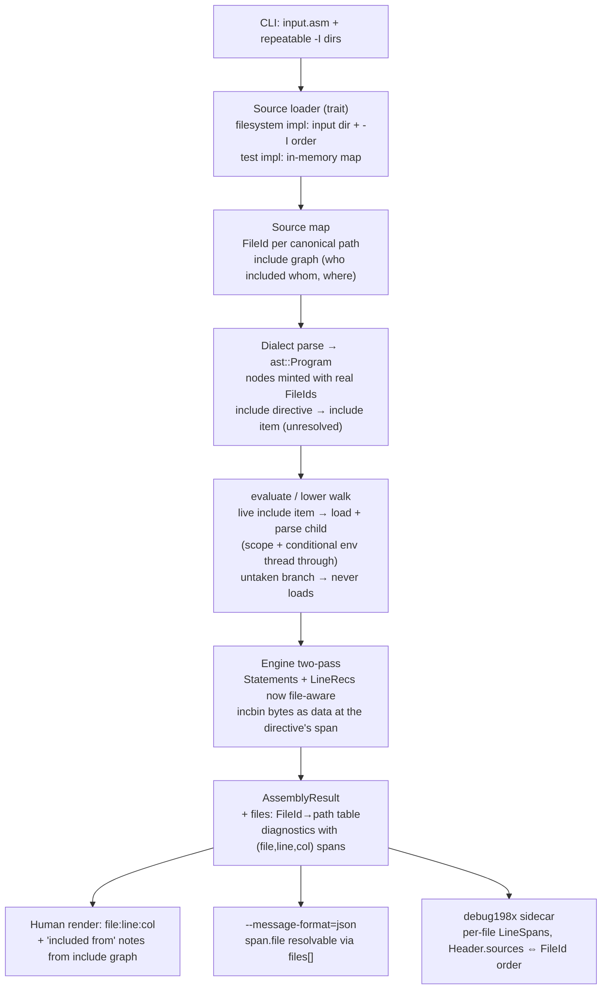
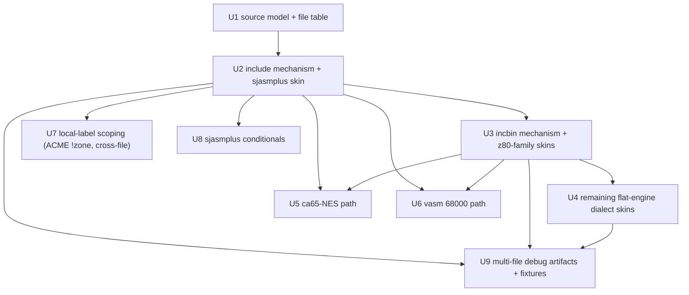

# Language Surface - Plan

## Goal Capsule

- **Objective:** Give asm198x the language-surface features a real program needs — **includes / incbin, local-label scoping, and conditional assembly** in v1, with **macros as a deliberate second stage** — implemented once at the engine/AST layer with thin per-dialect syntax skins, each differentially validated byte-identical against its reference assembler exactly as the instruction surface already is.
- **Product authority:** Steve Hill. Seeded from idea 4 of the 2026-07-03 ideation (`docs/ideation/2026-07-03-asm198x-world-class-ideation.html`). v1 scope confirmed 2026-07-06: *foundation first* — includes + local-labels + conditionals; macros are stage 2. Plan-time scoping confirmed 2026-07-07: conditionals adopt one keyword dialect (sjasmplus) in v1; includes/incbin cover the full dialect roster including the two non-flat pipelines; provenance is leaf-span; public symbols stay qualified-name-keyed.
- **Open blockers:** None.
- **Stop conditions:** A differential probe that cannot be made byte-identical stops the feature for that dialect until it is either fixed or explicitly gap-marked — never silently approximated. A change that would reshape (rather than extend) the `Span`, `AssemblyResult`, or debug198x record shapes stops for a decision-record amendment first (`decisions/core-contract-freeze.md`, `decisions/debug198x-format.md`).

---

## Product Contract

**Product Contract preservation:** unchanged except R5, amended 2026-07-07 (approved at plan-time scoping) to align with the newer binding decision `decisions/conditional-assembly-framework.md`, which demand-gates per-dialect conditional adoption. The original R5 read "works for every dialect per its own syntax"; the amended text below keeps the shared-mechanism intent and names the concrete v1 adopter.

### Summary

Today asm198x is single-file to its core, has no includes or incbin, supports conditional assembly only inside the ACME dialect, and scopes local labels through per-dialect string mangles. Curriculum-sized programs survive, but serious homebrew and demoscene work hits the wall immediately — the community's two loudest signals are that local-label scoping is the most-praised assembler feature and macros are the escape hatch users reach for. v1 adds the tractable, high-value foundation — **includes/incbin across the dialect roster, local-label scoping as a shared engine concept, and conditional assembly adopted by its first keyword dialect** — built once at the AST/engine layer with a thin per-dialect skin that maps each reference's *syntax and semantics*, validated dialect-by-dialect against the real tool. Macros (the hardest, most dialect-divergent piece) are a focused second stage on top. The load-bearing consequence: **includes force a multi-file source model**, so every byte, symbol, and diagnostic must be attributable to *(file, line, column)* through an include chain — the span shape was reserved for exactly this in Layer 0 (`crates/asm198x/src/span.rs`); this plan fills it with values.

### Problem Frame

The assembler validates instruction encodings byte-identically across 19 CPUs, but a program larger than a lesson cannot be written in it: no way to split source across files (`include`), pull in binary assets (`incbin`), or vary a build (`if`/`else`) outside ACME. Local-label scoping exists but as divergent per-dialect mangles with gaps (ACME's `!zone` is accepted and inert). The whole pipeline reads exactly one file, so a diagnostic can only name a line, never a file. This is the largest single gap between "byte-identical validated" and "usable for a real, non-trivial program," and it is the language surface every incumbent assembler has and asm198x does not.

### Key Decisions

- **Foundation first, macros second.** v1 is includes/incbin + local-label scoping + conditional assembly; macros (MACRO/ENDM, parameters, expansion) and their kin (repeat/DUP/rept, modules) are stage 2. The interlock is one-directional (macros *use* local labels and conditionals, not the reverse), so building the foundation first is the ground a good macro engine stands on, not throwaway work.
- **One engine mechanism, thin per-dialect skins — semantics included.** The engine/AST owns the *mechanism* (source-file inclusion, conditional evaluation, scope resolution, and later macro expansion); each dialect maps its own syntax **and its semantic quirks** onto that mechanism. This explicitly rejects "spelling-only skins": expect a shared core plus real per-dialect semantic work, validated dialect-by-dialect.
- **Source-compatible: the reference's syntax, exactly.** Each dialect's `include`/`incbin`/conditional/local-label spelling matches its reference assembler verbatim — no invented syntax (the binding `decisions/syntax-stance.md`). The assembler is a drop-in, not a new language.
- **Differential validation per dialect.** Every language feature is byte-identical to its reference, proven through the existing differential harness (`crates/asm198x/tests/differential.rs`) — one probe per feature per dialect, with the gap-marker mechanism for known non-reproducible cases.
- **Includes fill the reserved multi-file source model.** A byte can originate in an included file, so spans, symbols, and diagnostics track *(file, line, column)*. The span shape (`Span { file: FileId, line, col, expansion_frames }`) was locked in Layer 0 and needs **no reshape — only new `FileId` values and a file table**. The reserved `expansion_frames` stays empty (macro stage 2).

### Requirements

**v1 — the foundation**

- R1. **`include` (source inclusion):** an assembly can pull another source file's text in at the include point, per each dialect's syntax, including nested includes, byte-identical to the reference. The reference's include-search-path behaviour is honoured.
- R2. **`incbin` (binary inclusion):** an assembly can insert raw bytes from a file at the current location, byte-identical to the reference, honouring the reference's offset/length options where they exist.
- R3. **Multi-file source model:** every emitted byte, symbol, span, and diagnostic is attributable to *(source file, line, column)* through the include chain — replacing today's line-only model. A diagnostic in an included file names that file, not the top-level line.
- R4. **Local-label scoping as an engine concept:** local labels scope between global labels per each dialect's syntax, on the shared AST `Scope`/`Symbol` model rather than divergent ad-hoc mangles — closing the known gaps (ACME `!zone` is inert today) and keeping per-dialect semantics (pasmo-vs-sjasmplus divergence stays), byte-identical to each reference. Locals interact with include boundaries exactly as each reference does.
- R5. **Conditional assembly as a shared mechanism, adopted per dialect on demand** *(amended 2026-07-07)*: the shared `ast::CondEval`/`ast::evaluate` framework gains its first keyword-style adopter — **sjasmplus** (`IF`/`IFDEF`/`IFNDEF`/`ELSE`/`ENDIF`, `DEFINE`) — proving the generalization off ACME. Further dialects adopt on demand with a concrete driver, per `decisions/conditional-assembly-framework.md`; no speculative roll-out to every dialect.
- R6. **Per-dialect differential validation:** each language feature is covered by a byte-identical differential probe against its reference assembler, exactly like the instruction surface; known non-reproducible cases are gap-marked, not silently skipped.
- R7. **Room reserved for stage 2 and the contract:** the span/diagnostic model carries an (empty in v1) macro-expansion-frame stack and symbols stay distinct across scopes, so the stage-2 macro engine can populate them additively without a breaking change.

**What the contract and debug198x carry** — these were stated before the core contract landed; Layer 0/1 satisfied C1–C2 by reservation, and this plan completes them with values:

- C1. The structured result and diagnostics key spans on *(file, line, column)* — satisfied in shape (`src/span.rs`); this plan allocates real `FileId`s and adds the FileId→path table.
- C2. The diagnostic/span model reserves a macro-expansion-frame stack — satisfied (`Span.expansion_frames`, empty in v1); this plan must not repurpose it for include chains.
- C3. Symbol representations carry local-label **scope** so a local reused in two scopes resolves to two distinct symbols — satisfied in v1 by qualified-name keying (two scopes → two distinct qualified symbols); a structured scope field on debug198x `Symbol` records stays an additive stage-2 option.

### Acceptance Examples

- AE1. **Covers R1, R3.** A ca65 program that `.include`s a second file assembles byte-identical to `ca65`; a deliberate error in the included file produces a diagnostic naming *that file* and its line, not the top-level include line.
- AE2. **Covers R2.** An `incbin` of a binary asset inserts its bytes byte-identical to the reference, and the offset/length form (where the dialect has one) matches.
- AE3. **Covers R4.** A program that reuses a local-label name in two scopes assembles byte-identical to the reference — the locals do not collide — for a dialect whose reference has local scoping.
- AE4. **Covers R5.** A conditional-assembly program emits only the taken branch, byte-identical, for a **non-ACME** dialect (sjasmplus), proving the generalization off ACME.
- AE5. **Covers R6.** Each v1 feature has a differential probe that both our assembler and the reference reproduce byte-identically; a known non-reproducible case is gap-marked.
- AE6. **Covers R7, C1, C2.** A diagnostic carries a *(file, line, column)* span, and the span model serialises an empty expansion-frame stack without a format change — demonstrating the room reserved for stage-2 macros.

### Scope Boundaries

**Deferred for later (stage 2 — the macro stage)**

- **Macros** — `MACRO`/`ENDM` (and `.macro`/`.endmacro`, rgbasm's form), parameters, expansion, and the expansion-frame *population* the v1 span model reserves room for. The single hardest, most dialect-divergent piece; its own focused effort on the proven foundation.
- **Repetition** — `repeat`/`rept`/`DUP` and friends (part of the macro stage).
- **Modules / namespaces** — sjasmplus modules and similar (the sjasmplus.rs TODO's third item).
- **Conditional adoption beyond sjasmplus** — asl-family `IF…ENDIF`, lwasm, rgbasm conditionals follow the same recipe when a concrete driver appears (demand-gated per `decisions/conditional-assembly-framework.md`).
- **Structured scope on symbol records** — debug198x `Symbol` records gain a scope field additively if/when a consumer needs more than qualified-name distinctness.
- **Include-chain recording in spans** — v1 renders "included from" chains at the CLI from the include graph; recording the chain *inside* spans (a sibling field, never `expansion_frames`) is additive later if a JSON consumer needs it.

**Outside this product's identity**

- Inventing syntax — every feature spells exactly as its reference does; asm198x adds no language of its own.
- `stdin`/`-` as assembly input — includes make "the input file's directory" load-bearing; stdin has no directory and stays unsupported.
- Reformatting or splicing included files under `--fmt` — the formatter renders the include directive verbatim and never touches the included file.

### Dependencies / Assumptions

- **Grounding refreshed 2026-07-07** (supersedes the 2026-07-04 scout; Layer 0/1 and the Debug198x plan landed since):
  - Source is still single-file at every seam: the CLI reads one input (`main.rs:399`, second positional rejected), library entries take `source: &str` only, and `Span::at` hard-codes `FileId(0)` (`span.rs`). **No FileId→path table exists anywhere.**
  - **Every dialect routes through the shared AST** (`src/ast.rs`: `Program`/`Node`/`Item`, `parse_program` → `lower` → engine, `emit` → formatter). `ast::lower` rejects `Item::Conditional` and `Item::Native` — those are walked by their owners.
  - **The conditional framework exists and is governed**: `ast::CondEval` + `ast::evaluate`, ACME-only today (`AcmeEval`, `dialects/acme.rs`), with the binding adoption recipe and drift triggers in `decisions/conditional-assembly-framework.md` (2026-07-05). This plan's R5 was amended to match it.
  - **Local labels are per-dialect mangles into a flat table**: z80 `qualify_locals` (gated by `Z80Syntax::scopes_locals()` — sjasmplus scopes, pasmo doesn't), rgbasm and vasm carry their own copies, ca65 `@cheap` works, **ACME `!zone` is accepted but inert**, lwasm has none. The AST already models `Scope`/`Symbol`; `lower` collapses to the qualified string. `AssemblyResult.symbols` publicly exposes qualified names (tests assert `start.loop`).
  - **incbin/include: nothing exists** — every spelling falls into unknown-directive rejection in every dialect.
  - **debug198x is already multi-file-shaped on the format side** (`LineSpan.file: String`, `Header.sources`); the producer stamps one `source_path` everywhere (`listing.rs`). The engine's `Statement`/`LineRec`/`Warning` are file-less. Both the core contract and the sidecar format are **public drafts** under freeze governance — this plan is the window to populate multi-file correctly, and every format-visible change moves spec page + fixtures + a dated decision note in the same change.
  - **The vasm (68000) and ca65-NES paths parse their own text** (`Item::Native`, per `decisions/ast-native-payload-for-multipass-cisc.md`) — inclusion must sit at/above per-dialect parse, not inside `engine::assemble`.
  - **The differential harness already supports multi-file fixtures**: sources are written to a temp dir and tools run with `current_dir(tmp)` (`tests/differential.rs`); the ca65-816 arm already writes two files.
- All reference assemblers are installed locally (acme, ca65/ld65, pasmo, sjasmplus, rgbasm, lwasm, asl, the vasm suite) — probes and `--ignored` differential runs execute in full on this machine.
- Cross-cutting with Debug198x: the format's v1 freeze is pending the Emu198x importer (`decisions/debug198x-format.md`); multi-file line records land while it is still draft.

### Outstanding Questions

All previously-parked product questions are resolved (v1 scope 2026-07-06; plan-time scoping 2026-07-07). Remaining items are **deferred to execution, non-blocking** — each is a probe-then-decide inside its owning unit:

- Per-reference include-resolution order and incbin offset/length/EOF semantics — pinned by probing the installed binaries before each skin (KTD5); divergences gap-marked.
- Whether any reference accepts a conditional block spanning an include boundary (`IF` in the includer, `ENDIF` in the include) — expected rejected with a clear diagnostic; probe sjasmplus and gap-mark if it accepts (U8).
- `--listing` rendering shape for included files and incbin payloads — directional default: interleave included lines with a file margin, elide incbin to a one-line byte-count row (U9; the listing is a CLI convenience with no stability promise).

### Sources

- `docs/ideation/2026-07-03-asm198x-world-class-ideation.html` — idea 4 ("One macro engine, N dialect skins").
- `decisions/conditional-assembly-framework.md` — the binding evaluator seam, adoption recipe, and drift triggers R5 now matches.
- `decisions/syntax-stance.md` (source-compatible, no invented syntax; the probe-the-binaries precedent for pasmo-vs-sjasmplus locals), `decisions/roadmap-sequencing.md` (this plan is the Layer-2 item that finalizes the multi-file source model), `decisions/ast-native-payload-for-multipass-cisc.md`, `decisions/core-contract-freeze.md`, `decisions/debug198x-format.md`.
- `crates/asm198x/src/span.rs` — the reserved multi-file span shape this plan fills.

---

## Planning Contract

### Key Technical Decisions

- KTD1. **Structural include, lazily resolved in an interleaved walk.** An include directive parses into an AST item that records the directive line; the target file loads when the evaluation/lowering walk reaches it *live* — so an include inside an untaken conditional branch never loads (matching references), and `--fmt` renders the directive verbatim from `node.source` without ever splicing (preserving fmt idempotence and the `operand_span` borrow contract). The walk is the AcmeEval per-line model: each live line is parsed with the environment accumulated so far, and state defined inside an include — `equ` constants, the current global label, conditional definitions — flows *out* to the includer's subsequent lines. That outward flow is load-bearing, not a nicety: z80-family form selection consults a parse-time constants table (`bit`/`rst`/`ds` need the value to pick an encoding), so an include-defined constant must be visible to later includer lines or the first realistic probe diverges from the reference.
- KTD2. **One FileId space, one table — on both paths.** `AssemblyResult` gains an additive `files` list (index = `FileId`, `FileId(0)` = the root input); `debug198x::Header.sources` is ordered identically so `sources[i] ⇔ FileId(i)` is one convention across both formats. A file included twice dedups to one `FileId` by canonical path. The table survives failure: include-capable entry points return the source map on the error path too (AE1's error-in-an-included-file is a failure-path scenario — the human renderer and "included from" notes need it after an `Err`), and the serialized span gains an additive `#[serde(default)]` resolved-path field so JSON consumers of the bare diagnostic-array failure output can resolve files with no shape change (KTD7).
- KTD3. **Leaf-span provenance in v1.** Diagnostics carry the leaf *(file, line, col)*; the human renderer adds rustc-style `included from main.asm:3` notes derived from the include graph. Nothing is recorded in `Span.expansion_frames` — that slot is the macro reservation (C2) and include chains must not squat on it.
- KTD4. **Qualified-name symbols, no new shape.** Scope distinctness stays via qualified keys (`start.loop`) in the engine table, `AssemblyResult.symbols`, `--sym`, and debug198x `Symbol` records — compatible with the draft contract and existing tests. Structured scope fields are additive stage-2 options.
- KTD5. **Probe before skin.** Before implementing each dialect's include/incbin/conditional surface, pin the reference's semantics against the installed binary (search order, offset/length forms, EOF behaviour, cross-file edge cases) — the established probe method. Bytes match the reference exactly or the case is gap-marked; **diagnostics may exceed the reference** (cycle detection, missing-file errors with the directive's span) since diagnostics are not byte-compared.
- KTD6. **Conditionals follow the decision record's recipe, verbatim.** sjasmplus implements `CondEval` (~40 lines over its `DEFINE`/label environment), parses `IF`/`IFDEF`/`IFNDEF`/`ELSE`/`ENDIF` into `Item::Conditional`, routes through `ast::evaluate`, and adds the keyword style branch in `ast::emit`. No generic keyword-block parser is built ahead of a second keyword consumer — that is the record's first drift trigger.
- KTD7. **Draft-format changes carry their paperwork.** Every change visible in the contract JSON or the debug198x sidecar moves additively (new fields, serde defaults, skip-unknown preserved) with the spec page (`../docs/debug198x.md`), the fixture corpus, and a dated note in the owning decision record updated in the same change.
- KTD8. **The file loader is a seam, not a hard-wired filesystem.** Include resolution goes through a loader trait — the CLI wires a filesystem loader carrying the input's directory plus repeatable `-I` search paths (per-dialect resolution *order* is part of the dialect's semantics, probed per KTD5); tests wire an in-memory loader so unit tests stay hermetic. The trait carries both text and binary loads and owns path canonicalization — incbin resolves through the same seam with the same search-order machinery, so include and incbin cannot fork resolution behaviour and the in-memory loader covers U3's edge-case matrix. Binary assets mint no `FileId` and never appear in `Header.sources`; spans only ever point into source files. Library entry points gain additive include-capable variants; the existing `&str` entries stay untouched.

### High-Level Technical Design

The multi-file pipeline, showing where each new mechanism sits (directional guidance, not implementation specification):

Unit dependency order:

Per-dialect directive spellings the skins target (from reference documentation; each is **probe-confirmed before implementation** per KTD5 — the probe result, not this table, is authoritative):

| Dialect | include | incbin (offset/length form) |
|---|---|---|
| acme | `!src`/`!source "file"` | `!bin`/`!binary "file"[, size[, skip]]` |
| ca65 family | `.include "file"` | `.incbin "file"[, offset[, size]]` |
| pasmo | `include "file"` | `incbin "file"` |
| sjasmplus | `INCLUDE "file"` | `INCBIN "file"[, offset[, length]]` |
| rgbasm | `INCLUDE "file"` | `INCBIN "file"[, offset[, length]]` |
| lwasm | `include`/`use "file"` | `includebin "file"` |
| vasm (mot) | `include "file"` | `incbin "file"[, offset[, length]]` |
| asl chips | `include file` | `binclude "file"[, offset[, length]]` |

### Assumptions

- Cross-file conditional blocks (`IF` opened in the includer, closed in the include) are rejected with a clear diagnostic; if the sjasmplus probe shows the reference accepts them, the case is gap-marked rather than contorting the tree model (U8 probes this).
- A generous include-depth cap backstops cycle detection (cycles themselves are detected on the canonical-path stack and reported with the full chain).
- The engine's 64K image cap and the CP1610's word addressing (`addr_unit = 2`) interact with incbin only as range/length checks — probed against asl's `BINCLUDE` for the odd-byte-count case (U3).

---

## Implementation Units

### U1. Source model and the FileId→path table

- **Goal:** The foundation every other unit builds on: a source map that allocates `FileId`s per canonical path, records the include graph, and loads files through a loader seam; the contract's file table; the CLI's `-I` flag; human diagnostics that render `file:line:col`.
- **Requirements:** R3, C1. Groundwork for R1.
- **Dependencies:** none.
- **Files:** new `crates/asm198x/src/source.rs`; `crates/asm198x/src/contract.rs` (additive `files` field on `AssemblyResult`); `crates/asm198x/src/span.rs` (a constructor minting spans for a given `FileId` alongside `Span::at`); `crates/asm198x/src/main.rs` (repeatable `-I`, human `file:line:col` rendering replacing the `{input}: {e}` prefix); tests in `crates/asm198x/tests/contract.rs` and a new `crates/asm198x/tests/multifile.rs`.
- **Approach:** Loader trait (KTD8) with filesystem + in-memory impls; source map owns `FileId` allocation (dedup by canonical path, `FileId(0)` = root) and the include graph for "included from" rendering. `AssemblyResult.files` gets `#[serde(default)]` so older payloads still load (the U5-era skip-unknown/versioning tests in `tests/contract.rs` are the pattern). No dialect is wired yet — this unit is complete when a synthetic multi-file result renders and serialises correctly.
- **Patterns to follow:** the contract's additive-versioning tests (`tests/contract.rs`); CLI flag styles in `main.rs` (`--debug[=path]` bare-plus-value parsing); the container/clobber guard conventions around artifact writes.
- **Test scenarios:**
  - Same file requested via two spellings (`inc/../inc/defs.inc` vs `inc/defs.inc`) → one `FileId`.
  - `files` table serialises in JSON output and an older payload without `files` still deserialises (Covers part of AE6).
  - Human render of a diagnostic with a non-root `FileId` prints `that-file.inc:12:8`, not the input name; a synthetic include graph renders one `included from` note per hop.
  - `-I` accepts multiple directories and preserves order; unknown-flag rejection still works for everything else.
  - In-memory loader: missing file yields a loader error naming the request and the requesting file.
- **Verification:** `cargo test -p asm198x` green; JSON round-trip of a result with a populated `files` table is identity.

### U2. The include mechanism, proven on sjasmplus

- **Goal:** `INCLUDE` works end-to-end for sjasmplus — nested includes, reference-matching search order, cycle/missing-file diagnostics carrying the directive's span — through the lazy structural include item (KTD1), with the engine made file-aware.
- **Requirements:** R1, R3, R6. AE1's mechanism (the ca65 spelling of AE1 lands in U4/U5).
- **Dependencies:** U1.
- **Files:** `crates/asm198x/src/ast.rs` (include item + the lazy resolution in the walk; `emit` renders the directive verbatim); `crates/asm198x/src/engine.rs` (file on `Statement`/`LineRec`/`Warning`; `AsmError` spans carry real `FileId`s; the 64K-cap error gains the offending span); `crates/asm198x/src/dialects/z80.rs` + `sjasmplus.rs` (directive recognition, search-order semantics); `crates/asm198x/src/lib.rs` (additive include-capable entry points); `crates/asm198x/tests/multifile.rs`, `crates/asm198x/tests/differential.rs` (multi-file probes), `crates/asm198x/tests/fmt.rs` (include line survives `--fmt` verbatim, idempotent).
- **Approach:** Probe sjasmplus first (KTD5): resolution order (current file's directory vs cwd vs `-i` paths), nested include behaviour, locals across the boundary, error text on missing file. Then the skin: recognise `INCLUDE`, build the include item, resolve lazily in the walk with parser scope state threaded through (a global label in the includer scopes leading-`.` locals at the top of the include, iff the probe confirms the reference does that). Note the structural cost KTD1 names: this restructures the sjasmplus parse pipeline — the eager per-line parse becomes walk-driven (the AcmeEval model) so each line parses with the live environment, letting include-defined `equ` constants feed later form selection; U8 inherits this mechanism rather than relocating it.
- **Execution note:** characterization instruments stay green throughout — the existing sjasmplus differential probes, curriculum corpus, and fmt round-trips are the stop-and-revert signal, exactly as vasm U5 ran.
- **Test scenarios:**
  - Covers AE1 (mechanism): two-file and three-deep nested sjasmplus programs byte-identical to the reference (differential probes).
  - A deliberate error in the included file → diagnostic names the included file and line, with an `included from` note (Covers R3).
  - Self-include and A→B→A cycle → clear diagnostic listing the chain; depth backstop fires on a pathological chain.
  - Missing include target → diagnostic at the directive's span, not a CLI-level read error.
  - Local labels across the include boundary match the reference's behaviour (probe-pinned).
  - `--fmt` of a file with `INCLUDE` reproduces the directive byte-identically, is idempotent, and never opens the target; formatting succeeds when the target does not exist.
- **Verification:** `cargo test -p asm198x` green; `cargo test -p asm198x --test differential -- --ignored` green including the new multi-file probes; `--test curriculum -- --ignored` unchanged.

### U3. The incbin mechanism, z80-family first

- **Goal:** `INCBIN` inserts file bytes at the current location for sjasmplus and pasmo, honouring offset/length forms, with the edge-case matrix (missing file, offset/length past EOF, zero length, 64K cap, word-addressed CPUs) probed and specified.
- **Requirements:** R2, R6.
- **Dependencies:** U2 (loader + file-aware engine).
- **Files:** `crates/asm198x/src/ast.rs` (binary-inclusion item lowering to raw data bytes); `crates/asm198x/src/engine.rs` (byte payload at the directive's span; `addr_unit` length accounting); `crates/asm198x/src/dialects/z80.rs`/`sjasmplus.rs`; `crates/asm198x/tests/multifile.rs`, `tests/differential.rs`.
- **Approach:** Probe sjasmplus/pasmo incbin semantics (offset/length clamping vs error at EOF) and asl's `BINCLUDE` odd-byte behaviour for the CP1610's decle accounting before implementing. Bytes ride the engine as data with one LineRec covering the payload at the directive's line.
- **Test scenarios:**
  - Covers AE2: plain incbin and offset/length forms byte-identical to sjasmplus; pasmo's plain form byte-identical.
  - Missing asset, offset beyond EOF, length beyond remaining → diagnostics at the directive's span matching the probed reference posture (error vs truncate; if the reference silently truncates, bytes match and asm198x adds a warning).
  - Zero-length incbin emits nothing and assembles cleanly.
  - An incbin that pushes the image past 64K → engine cap error carries the incbin's span, not line 0.
- **Verification:** differential probes green or gap-marked with issues filed; `cargo test -p asm198x` green.

### U4. Include/incbin across the remaining flat-engine dialects

- **Goal:** The mechanism reaches the rest of the roster: acme, the ca65-flat family (6502 flat, 65816, HuC6280), rgbasm, lwasm, and the asl-syntax chips — each spelling probed, skinned, and differentially validated.
- **Requirements:** R1, R2, R6; completes AE1's ca65 spelling on the flat path.
- **Dependencies:** U2, U3.
- **Files:** `crates/asm198x/src/dialects/{acme,ca65,ca65_816,ca65_huc6280,rgbasm,lwasm}.rs` and the asl-family dialect modules; `tests/differential.rs` probes per dialect.
- **Approach:** Repetition of the U2/U3 pattern per dialect: probe (search order, offset/length forms — acme's `!binary` size/skip argument order is a known trap to pin), skin, differential probe. The asl chips share one syntax — one skin, probed on a representative chip, spot-checked on a second. Land as one commit per dialect family so a probe surprise never blocks the rest. **ACME is not thin repetition:** `prescan_anons` resolves anonymous `-`/`+` labels by textual position over the single root source string, so the acme skin must collect anons in spliced evaluation order across files — its include item resolves inside the existing AcmeEval walk, not via a root-string prescan.
- **Test scenarios (per dialect family):**
  - Covers AE1/AE2 per dialect: one include probe (nested), one incbin probe (plain + offset/length where the reference has it), byte-identical or gap-marked.
  - Error-in-included-file names the included file (one dialect-family spot check each; the mechanism is shared).
  - An anonymous `-`/`+` label defined or referenced across an acme `!src` boundary resolves byte-identical to acme (differential probe).
  - `--fmt` verbatim round-trip of each dialect's include/incbin spelling.
- **Verification:** full `--ignored` differential suite green; curriculum corpus unchanged.

### U5. Includes/incbin on the ca65-NES assemble+link path

- **Goal:** The include-heavy NES audience gets the same surface through the `Item::Native` ca65 pipeline — `.include`/`.incbin` resolve identically in `assemble_ca65`/`assemble_with_debug`, with per-file provenance flowing into the linked image's debug capture.
- **Requirements:** R1, R2, R3; AE1 on the path real NES projects use.
- **Dependencies:** U2, U3.
- **Files:** `crates/asm198x/src/dialects/ca65.rs` (its own parse pipeline picks up the shared loader/source map); `tests/differential.rs` (ca65+ld65 multi-file probe, following the existing two-file ca65-816 arm), `tests/debug_cli.rs`.
- **Approach:** The ca65 driver owns its parse, so it consumes the U1 source map directly rather than the flat engine's threading. The linker/debug capture (`DebugCapture`) records per-file line spans.
- **Test scenarios:**
  - A NES program split across `.include`d files links byte-identical to ca65+ld65 (differential).
  - `.incbin` of CHR data lands byte-identical in the ROM.
  - A diagnostic inside an included segment file names that file; `--debug` line records name per-file sources.
- **Verification:** differential + `cargo test -p asm198x` green; existing ca65 duplicate-symbol/overlap guards unchanged.

### U6. Includes/incbin on the vasm 68000 path

- **Goal:** The Amiga audience: `include`/`incbin` through vasm's multipass `Item::Native` pipeline, in both flat (`assemble_vasm_warned`) and hunk-executable outputs.
- **Requirements:** R1, R2, R3.
- **Dependencies:** U2, U3.
- **Files:** `crates/asm198x/src/dialects/vasm.rs`; `tests/differential.rs` (vasm multi-file probe); `tests/debug_cli.rs`.
- **Approach:** Same shape as U5 — vasm's `parse_program`/`assemble_core` consumes the source map; its `DebugCapture` records per-file spans. Characterization-first: the 68000 sweep and existing vasm snapshots are the stop-and-revert instruments.
- **Test scenarios:**
  - A two-file 68000 program assembles byte-identical to vasm (flat), and a hunk-exe build with an included file matches.
  - `incbin` with vasm's offset/length form matches; per-file debug line records verified.
- **Verification:** differential + 68000 sweep green; existing vasm characterization snapshots unchanged.

### U7. Local-label scoping as the shared engine concept

- **Goal:** Close R4's gaps on the shared AST `Scope`/`Symbol` model: ACME `!zone` becomes real (zone-scoped `.locals`), duplicated qualify helpers consolidate where semantics genuinely coincide, and locals interact with include boundaries per each reference.
- **Requirements:** R4, C3, R6.
- **Dependencies:** U2 (include boundaries in play).
- **Files:** `crates/asm198x/src/ast.rs` (shared qualification helper over `Scope`/`Symbol` where dialects coincide); `crates/asm198x/src/dialects/acme.rs` (`!zone` activation); `dialects/z80.rs`/`rgbasm.rs`/`vasm.rs` (consolidation only where behaviour is provably identical — pasmo-vs-sjasmplus divergence is load-bearing and stays); `tests/differential.rs` probes.
- **Approach:** Probe acme's `!zone` semantics (named and anonymous zones, `.local` reuse across zones) before implementing. Consolidate mangles into the AST helper only where the per-dialect probes prove identical semantics — no premature generalisation (`decisions/syntax-stance.md`). Public symbol keys stay qualified names (KTD4).
- **Test scenarios:**
  - Covers AE3: `.local` reused across two `!zone`s assembles byte-identical to acme; the two locals are distinct symbols in `AssemblyResult.symbols`.
  - Existing z80/rgbasm/ca65-cheap local tests unchanged after any consolidation (pure refactor proof).
  - A local defined before any global, and a local referenced from the wrong scope → errors matching each reference's posture (probe-pinned).
  - Locals across an include boundary: reference-matching behaviour for sjasmplus and acme (extends the U2 boundary scenario to acme).
- **Verification:** full differential + curriculum suites green; `--sym` output unchanged in shape.

### U8. Conditional assembly: the sjasmplus adoption

- **Goal:** sjasmplus becomes the first keyword-style `CondEval` adopter — `IF`/`IFDEF`/`IFNDEF`/`ELSE`/`ENDIF` + `DEFINE` — proving the generalization off ACME, including conditional-guarded includes.
- **Requirements:** R5 (amended), R6; AE4.
- **Dependencies:** U2 (guarded includes need lazy resolution).
- **Files:** `crates/asm198x/src/dialects/sjasmplus.rs` + `z80.rs` (CondEval impl, keyword parse into `Item::Conditional`, routing through `ast::evaluate`); `crates/asm198x/src/ast.rs` (the keyword style branch in `emit` — the recipe's step 4, built now that its first consumer exists); `tests/differential.rs`, `tests/fmt.rs`.
- **Approach:** The decision record's four-step recipe, verbatim (KTD6). Probe sjasmplus first: expression forms in conditions, `DEFINE` semantics, nesting depth, `ELSE IF` spellings, and the cross-file `IF…ENDIF` question (expected rejected; gap-mark if accepted).
- **Test scenarios:**
  - Covers AE4: taken/untaken branches, nested conditionals, `IFDEF` on a `DEFINE`d and undefined name — each byte-identical to sjasmplus.
  - `IF 0 / INCLUDE "missing.inc" / ENDIF` assembles cleanly — the untaken include never loads (KTD1's proof).
  - A skipped branch defines nothing (the environment-threading property the shared walk guarantees).
  - `--fmt` renders keyword conditionals idempotently via the new emit style branch; ACME's brace rendering unchanged.
  - Cross-file `IF…ENDIF` → clear diagnostic (or gap-marked per probe).
- **Verification:** differential probes green; all 142 ACME curriculum conditional files still byte-identical (the evaluator is shared — regressions here are the alarm).

### U9. Multi-file debug artifacts and the fixture corpus

- **Goal:** The debug surface tells the truth about multi-file programs: per-file `LineSpan`s, `Header.sources` in FileId order, multi-file `--sym`/`--listing`, a new multi-file fixture family, and the format paperwork.
- **Requirements:** R3, C1; the debug198x leg of the multi-file model.
- **Dependencies:** U2 (file-aware LineRecs); U3 (incbin line records feed the listing's elided-row scenario); U4 useful for breadth but not blocking.
- **Files:** `crates/asm198x/src/listing.rs` (per-file stamping replaces the single `source_path`; `render_listing` multi-file rendering); `crates/asm198x/src/main.rs` (artifact plumbing); `crates/asm198x/tests/fixtures/debug198x/` (a new multi-file family, e.g. `z80-spectrum-multifile`); `crates/asm198x/tests/debug198x_fixtures.rs`, `tests/debug_cli.rs`; **sibling repo** `../docs/debug198x.md` (sources-ordering + per-file LineSpan semantics) and `decisions/debug198x-format.md` (dated note) in the same change (KTD7); `decisions/roadmap-sequencing.md` (mark the language-surface Layer-2 bullet complete for v1, macros recorded as the stage-2 follow-on — the DoD close-out this closing unit owns).
- **Approach:** `Header.sources` ordered by FileId (KTD2); `LineSpan.file` carries each record's own file as written. Listing interleaves included lines with a file margin and elides incbin payloads to a one-line byte-count row (directional; the listing carries no stability promise). Fixture normalization follows the existing `tool_version`-stripping pattern.
- **Test scenarios:**
  - The new always-on fixture family: a two-file program's sidecar has per-file line records and a two-entry `sources`, golden-matched.
  - `--debug` on a multi-file program via the CLI: line records name the included file for its bytes; `--sym` unchanged in shape.
  - `--listing` shows included lines with their file identified and an elided incbin row.
  - A sidecar with the new fields is skipped-unknown-cleanly by a v0 reader posture (the format's additive promise, exercised as in the existing corpus).
- **Verification:** `cargo test -p asm198x` green (fixtures are always-on); spec page and decision record updated in the same commit as the emission change.

---

## Verification Contract

| Gate | Command | Applies to |
|---|---|---|
| Always-on suite (contract, fmt round-trip, debug fixtures, CLI, multifile) | `cargo test -p asm198x` | every unit |
| Differential probes vs reference assemblers | `cargo test -p asm198x --test differential -- --ignored` | U2–U8 |
| Curriculum corpus byte-identity | `cargo test -p asm198x --test curriculum -- --ignored` | U2, U4–U8 |
| Conformance sweeps (regression guard) | `cargo test -p asm198x --test conformance -- --ignored` | U6 (68000 sweep) |
| Format | `cargo fmt --all --check` | every commit (blocking hook) |
| Lint | `cargo clippy --workspace --all-targets -- -D warnings` | every commit |
| Coverage floor | CI (`scripts/coverage-gate.sh`) | every PR |

Byte-identity to the reference is the acceptance bar for every dialect-facing scenario; a probe that cannot reach it is gap-marked with a filed issue, never silently skipped (R6). Conventional commits throughout (release-plz derives versions and the changelog).

---

## Definition of Done

- All nine units landed in dependency order, each with its probes green or explicitly gap-marked.
- AE1–AE6 each demonstrated by a named test (AE1: U4/U5 ca65 probes + U2's error-in-include; AE2: U3/U4; AE3: U7; AE4: U8; AE5: the probe set as a whole; AE6: U1's serialisation tests).
- The core contract and debug198x changes are additive, with `../docs/debug198x.md`, the fixture corpus, and dated notes in `decisions/core-contract-freeze.md`/`decisions/debug198x-format.md` moved in the same changes that touched the formats (KTD7).
- `decisions/roadmap-sequencing.md` updated: the language-surface Layer-2 bullet marked complete for v1, macros recorded as the stage-2 follow-on.
- No abandoned experimental code in the diff; `cargo fmt`/clippy/coverage gates green; the full `--ignored` suites pass on this machine (all reference tools installed).
- Stage-2 items (macros, repetition, modules, further conditional adopters, structured symbol scope) remain deferred and recorded in Scope Boundaries — not partially started.
