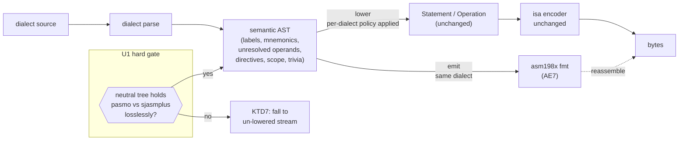

# Intermediate Representation (AST) - Plan

## Goal Capsule

- **Objective:** Introduce a **source-preserving intermediate representation** — a shared, dialect-neutral **semantic AST** sitting between parsing and byte-lowering — that carries labels, instructions (with *unresolved* operand expressions), directives, and (as idea 4 lands) macro/include/conditional/scope constructs, with `(file, line, column)` provenance, symbol scope, and comments carried as **trivia**. It is the foundation four other ideas independently demand. v1 is the **A+ shape** (semantic AST + comment trivia), deliberately designed to grow toward per-dialect lossless syntax trees later, without committing to that machinery now.
- **Product authority:** Steve Hill. Surfaced by mapping ideas 3–7 — the keystone *under* idea 3's contract. Ambition level (A+, grow-toward-B) chosen 2026-07-04 after reviewing the IR design space (AST vs lossless CST; single vs layered; the rust-analyzer/rowan and Roslyn red-green precedents).
- **Open blockers:** None. The isa/encoding layer underneath is unchanged; this is a new layer *above* it.

---

## Product Contract

### Summary

Today the assembler lowers too early: parsing produces an already-encoding-oriented form (`Statement`/`Operation`, with the addressing mode resolved to a `&'static str`, operands lowered to encoding `Piece`s, comments stripped), so nothing downstream can operate on *source structure*. Mapping ideas 3–7 showed four of them independently need a tree that sits *before* that lowering — the dialect converter (to re-emit source), the language surface (macros expand, includes splice, conditionals prune, locals scope — all tree operations), the contract's diagnostics and dbg198x (provenance is node metadata), and the cycle listing (cost mapped to structure). This plan introduces that tree: a **shared, dialect-neutral semantic AST**. All dialects of a CPU parse into it; flat-engine dialects lower to today's encoding form → bytes (the isa layer is untouched), while segmented/linked dialects like ca65 → `.nes` are an open v1 exception (see AE1). v1 is the **A+** design — the semantic AST with comments carried as trivia — the cheapest shape that unblocks every near-term consumer while reserving room to grow into a two-layer per-dialect-lossless architecture if full-fidelity conversion or incremental LSP ever become scheduled goals. It deliberately does **not** build per-dialect concrete syntax trees or a red-green/rowan tree now — that would be IDE-scale complexity ahead of need for a solo-maintained assembler.

### Problem Frame

The pipeline's front half throws away exactly what the family's next wave of features needs. Parsing jumps straight to an encoding-oriented representation, so: the converter has "no seam" to reconstruct source (its only reuse route, disassemble→reassemble, loses labels and structure); the language surface has no tree to expand macros, splice includes, or prune conditionals on (the ACME-only conditional preprocessor and the Z80-only local-label mangle are ad-hoc proto-versions of the missing layer); diagnostics and dbg198x can only name a line, never a file/column/scope/expansion-frame, because the byte-lowered statement carries none of that. The absence is invisible from any single feature and obvious across four — which is why it was found by mapping the ideas before planning them. It is the true foundation under the "core contract": idea 3's structured result and its bidirectional `Dialect` trait are really *about* this representation.

### Key Decisions

- **A+ shape: one shared dialect-neutral semantic AST + comment trivia.** A single tree, shared across a CPU's dialects at the semantic level, that defers lowering and carries provenance, scope, and comments-as-trivia. Not a lossless concrete syntax tree, not a red-green tree.
- **Designed to grow toward the two-layer split, without building it.** The chosen semantic AST *is* the shared-semantic layer of the eventual "per-dialect lossless CST → shared semantic AST" architecture. Adding per-dialect CSTs later is therefore additive, not a rewrite. v1 does not build them.
- **The isa/encoding layer is unchanged.** The AST lowers *to* today's `Statement`/`Operation` encoding form and thence to bytes; this is a new layer *above* the encoder, not a replacement of it. Output bytes are identical for flat-engine dialects (segmented/linked dialects like ca65 are an open exception — see AE1).
- **The AST is the pivot that makes dialects bidirectional.** *Parse* is source → AST (every dialect, v1; segmented/linked dialects' coverage is an open exception, see AE1). *Emit* is AST → source (built per idea 6, the converter). This is what turns idea 3's `Dialect` trait bidirectional (its R4).
- **Comments ride as trivia from day one.** Carrying comments attached to nodes is the cheap 80% of losslessness — it reserves the converter's later comment-fidelity without paying for full per-dialect CSTs or exact-formatting round-trip now (the same "reserve the room" discipline idea 3 used for expansion frames and banking).
- **Provenance and scope are first-class node metadata.** Every node carries `(file, line, column)` through include chains, reserved room for macro-expansion frames, and symbol scope — precisely what idea 4's C1–C3 and dbg198x require.

### Requirements

- R1. A **source-preserving semantic AST** sits between parse and lowering: dialects parse source → AST; the AST lowers to the existing encoding form → bytes, with **byte-identical output** to today for flat-engine dialects (segmented/linked dialects like ca65 are an open v1 exception — see AE1). The isa/encoding layer is unchanged.
- R2. The AST is **dialect-neutral at the semantic level** — shared across a CPU's dialects — representing labels, instructions (mnemonic + *unresolved* operand expressions), directives, and, as idea 4 lands, macro/include/conditional/scope constructs.
- R3. Every AST node carries **source provenance**: `(file, line, column)` through include chains, with reserved room for macro-expansion frames (populated when idea 4's macros land).
- R4. Symbols carry **scope**, so a local label reused in two scopes is two distinct symbols in the AST.
- R5. **Comments are carried as trivia** attached to nodes (not stripped), so the converter and a later fidelity stage can emit them — even though v1 does not fully round-trip exact formatting.
- R6. The AST is the **pivot for bidirectional dialects**: parse (source → AST) ships in v1 for every dialect (segmented/linked dialects an open v1 exception, see AE1); a **minimal same-dialect emit path + `asm198x fmt`** also ships in v1 as the emit proof (AE7), while full multi-dialect / full-fidelity emit (AST → source *across* dialects) is enabled by the design and built per idea 6.
- R7. The design is **explicitly extensible toward per-dialect lossless CSTs** (the two-layer architecture) — the AST is that split's shared-semantic layer — as an additive future step, not a rewrite. v1 builds neither CSTs nor a red-green tree.

### Relationship to the family (what this unblocks)

- C1. **Idea 3 (contract):** the AST is the real substance of idea 3's R1 "structured result" at the *source* level (distinct from the byte-level image, which is a lowering of it) and the pivot for R4's bidirectional `Dialect`. Idea 3's contract should be planned with the AST as R1's core.
- C2. **Idea 4 (language surface):** macros/includes/conditionals/locals are AST operations (expand/splice/prune/scope) — idea 4 builds *on* the AST, which is its prerequisite.
- C3. **Idea 6 (converter):** the converter is parse → AST → emit; the AST + emit direction is its foundation (instruction/directive-level now, comment fidelity later via trivia).
- C4. **Idea 5 (cycle listing):** cost annotations hang off AST nodes.
- **The formatter is the AST's first beneficiary.** `asm198x fmt` — parse → AST → emit in the *same* dialect — is the smallest thing that exercises the emit direction (R6) end to end, so it doubles as the AST's own acceptance test (AE7) *and* ships a real user-facing feature (a canonical formatter, which no retro assembler has) before the converter needs emit. See *Opportunities*.
- **Sequencing:** the AST is the **first foundational build** — it sits under idea 3, idea 4, and idea 6. It comes before or with idea 3, and before idea 4/6.

### Acceptance Examples

- AE1. **Covers R1.** A representative program parses to an AST and lowers to **byte-identical** output versus today — the new layer changes structure, not bytes (the existing **flat-engine** conformance corpus still passes). *Exception:* segmented/linked dialects that bypass the flat engine (e.g. ca65 → `.nes` via its own assemble + link path) sit outside this lowering; whether AST v1 covers them or scopes them out is an open question (see **Deferred / Open Questions**).
- AE2. **Covers R3.** A program that includes a second file produces AST nodes whose provenance names the *included* file, line, and column — not the top-level include line.
- AE3. **Covers R5.** A comment in the source is present as queryable trivia on the AST, not dropped.
- AE4. **Covers R4.** A local label reused in two scopes yields two distinct scoped symbols in the AST.
- AE5. **Covers R6.** A dialect emits AST → source for a simple program, producing source the reference assembler accepts and assembles identically (proving the bidirectional pivot).
- AE6. **Covers R2.** Two dialects of one CPU (e.g. pasmo and sjasmplus) parse an equivalent program to the same shared semantic AST.
- AE7. **Covers R5, R6 — the formatter proof.** A program round-trips through parse → AST → emit *in its own dialect* (`asm198x fmt`) and assembles byte-identical to the original, with **no comment dropped** (positional trivia fidelity — leading vs trailing — and operand-literal spelling are the fmt fidelity floor, deferred to planning; see **Deferred / Open Questions**). This is the cheapest possible proof the emit direction works — it needs no second dialect — and it lands the AST's first user-facing beneficiary (a canonical formatter) before idea 6's converter needs emit.

### Opportunities the AST unlocks (enabled later, not v1 scope)

The AST's deeper value is that most modern language tooling is the **same machinery** — a source-preserving tree, queries over it, and an emit direction — wearing different hats. Building the substrate once makes each of these a small increment when wanted, not a project; none is v1 **beyond the minimal same-dialect `fmt` proof (AE7)**, and the A+ shape (trivia from day one, grow-toward-B) is chosen precisely to keep every door here open. **Discipline holds absolutely: these analyze and *suggest*, they never silently rewrite what the programmer wrote** — the source-compatible, byte-identical stance is non-negotiable, so nothing here mutates semantics.

- **Formatter (`asm198x fmt`)** — the converter with source and target the *same* dialect: canonical formatting, comments preserved. Every modern language has one; no retro assembler does. The cheapest emit proof (AE7) and the AST's first user-facing win.
- **Error recovery / multi-error reporting** — a tree-producing parser recovers past a syntax error, reports every error at once, and hands tooling a *partial* AST for source that doesn't parse — which is what makes an LSP usable mid-edit. Impossible with today's parse-and-fail.
- **Structure-aware linting** — lints that see shape, not bytes: unused labels, unreachable code after an unconditional branch, out-of-range branches, silent truncation (`lda #$100`), dead code in a false conditional. Feeds idea 7's coded explain-pages and idea 3's diagnostics — a shellcheck-for-asm.
- **Refactoring / codemods** — scope-aware rename, extract-a-sequence-into-a-macro, inline-a-constant. The dialect converter is *one* codemod; the rest are the same shape. This is what makes the LSP (idea 3) and Forge198x feel like a modern IDE, not a coloured text editor.
- **Agent-native structural editing** — give the MCP surface (idea 3) the AST as its API, and an agent edits assembly *structurally* ("add a subroutine", "rename in scope") instead of manipulating text ranges. The deepest realization of the family's agent-native goal.
- **Macro-expansion viewer** — with idea 4's macros on the AST and dbg198x's expansion frames, show the before/after of an expansion — a teaching and debugging aid emulators rarely offer.
- **Semantic diff** — compare two programs at the tree level ("assemble identically, comments changed"; "this label moved, nothing else"). Canonicalization for the verdict pipeline; step-to-step teaching for Code198x.

Each lands somewhere in the family — the formatter in Code198x listings, the linter in the docs site and the LSP, refactoring in Forge198x, structural editing in the agent-native goal. Together they are the reframe: the AST turns *an assembler* into *a language service for retro assembly* — the same "platform, not a tool" ambition that justified the contract, one layer deeper. They are captured here deliberately; each can become its own brainstorm when pursued, and none is committed by this plan.

### Scope Boundaries

**Deferred for later**

- **Per-dialect lossless CSTs** (the two-layer / approach-B upgrade) — additive when full-fidelity conversion or incremental LSP become scheduled goals.
- **A red-green / incremental tree** (approach C, rust-analyzer style) — IDE-scale; not built.
- **Full formatting round-trip** — v1 keeps comments as trivia but does not reproduce exact whitespace/layout.
- **Macro-expansion-frame population** — the room is reserved (R3); idea 4's macros fill it.
- **The emit direction's full breadth** — a minimal same-dialect emit + `asm198x fmt` is v1 (the emit proof, AE7); full multi-dialect / full-fidelity emit is enabled-by-design and built out by idea 6.

**Outside this product's identity**

- Replacing the isa/encoding layer — unchanged; the AST lowers *to* it.
- Inventing dialect syntax — dialects stay source-compatible; the AST is internal.
- Competing with the byte-level structured result — that result *is* a lowering of the AST, not a rival representation.

### Dependencies / Assumptions

- Verified across this session's scouts (`/tmp/compound-engineering/ce-brainstorm/macro-engine/grounding.md`, `.../dialect-converter/grounding.md`): parse lowers directly to `Statement`/`Operation` (`engine.rs:346`, `:256`) with the addressing mode resolved to a string and operands lowered to encoding `Piece`s; comments are stripped at parse (`strip_comment`, `z80.rs:29-30`); no source-preserving tree exists; the ACME conditional preprocessor (`acme.rs:214-307`) and the Z80 local-label mangle (`z80.rs:451-496`) are ad-hoc proto-versions of the missing layer.
- **This is the foundation for ideas 3, 4, and 6** (and 5). It should be planned and built first; idea 3's contract (R1/R4) is re-conceived around it, and ideas 4/6 depend on it.
- Design precedents reviewed (external): rust-analyzer/`rowan` and Roslyn (lossless red-green trees + trivia), LLVM (layered IR), tree-sitter (CST grammars). A+ borrows the **trivia** concept without the full lossless-tree machinery.

### Outstanding Questions

- How **dialect-neutral** the shared AST can truly be given per-dialect *semantic* quirks (not just spelling) — where per-dialect semantics live: in the parse→AST lowering, or as node annotations. A real design question for planning, and the crux the two-layer split would eventually resolve.
- Whether the AST **wraps or replaces** the existing `Statement`/`Operation` — is today's form enriched into the AST, or a distinct type the AST lowers to? Planning.
- The exact **trivia model** — which nodes carry comments, leading vs trailing — planning.
- **Sequencing with idea 3:** does the AST fold into idea 3's plan as R1's core, or stand as its own foundational plan idea 3 depends on? (Lean: its own, planned first, since it also serves ideas 4 and 6 independently of idea 3's diagnostics/spec-query.)

### Sources

- Session mapping of ideas 3–7 and their grounding scouts (2026-07-04) — the four consumers that surfaced the need.
- `docs/plans/2026-07-03-003-feat-core-contract-plan.md` (idea 3), `docs/plans/2026-07-04-001-feat-language-surface-plan.md` (idea 4), `docs/plans/2026-07-04-003-feat-dialect-converter-plan.md` (idea 6), `docs/plans/2026-07-04-002-feat-cycle-analyzer-plan.md` (idea 5) — the dependents.
- External prior art: rust-analyzer / `rowan` (lossless red-green trees), Roslyn (red-green + trivia), LLVM (layered IR), tree-sitter (CST grammars).

---

## Planning Contract

*Enriched to implementation-ready 2026-07-04 (ce-plan), after two ce-doc-review rounds. **Product Contract unchanged** — R1–R7 and AE1–AE7 are preserved verbatim; this section adds only the HOW. Code anchors re-verified against the working tree this session (the CP1610 WIP is committed, tree clean); line numbers below are current, not the drifted ones the requirements draft carried.*

### Key Technical Decisions

- **KTD1 — The AST is a distinct type that *lowers to* today's `Statement`/`Operation`, not an enrichment of them.** `Statement` (`crates/asm198x/src/engine.rs:347`) and `Operation` (`:259` `Instruction`, `:269` `Encoded(Vec<Piece>)`) are already encoding-lowered; the AST is a new module (`crates/asm198x/src/ast.rs`) *above* them. Pipeline becomes `source → parse → AST → lower → Statement/Operation → encode → bytes`. The `isa`/encoding layer and `Piece`/`Expr` (`engine.rs:283`/`:153`) are untouched (R1). Rationale: preserves the byte-identical guarantee for free — the same encoder runs, reached by a new path.
- **KTD2 — Risk-first: U1 is a hard gate.** The load-bearing premise (one dialect-neutral tree holds semantically-divergent dialects) is validated by a throwaway spike *before* any production AST is built. If the spike needs per-dialect escape hatches that duplicate semantics in every consumer, **stop** and take KTD7. This directly discharges the round-1 "commits the foundation before validating" finding.
- **KTD3 — Per-dialect *semantics* stay out of the tree where they already are.** The neutral AST carries structure (labels, mnemonics, unresolved operand expressions, directives, scope, trivia). Per-dialect *policy* — the oversize rule (`Oversize::{Error,Truncate,TruncateWarn}`, `dialect.rs:19`) applied at `emit_byte`, `addr_unit` (`dialect.rs:67`) — stays a dialect attribute applied at lowering, exactly as today, **not** encoded in the tree. This is what lets pasmo and sjasmplus share one AST (AE6) while still assembling to their own bytes. The spike (U1) confirms this holds or forces a different home.
- **KTD4 — Segmented/linked dialects are scoped OUT of AST v1.** ca65 (`crates/asm198x/src/dialects/ca65.rs:116`) runs its own assemble + link pass to a `.nes` and never produces `Statement`/`Operation`; segment placement has no notion in the single-origin engine. AST v1's byte-identical guarantee (R1/AE1) is measured against the **flat-engine** conformance corpus only. ca65 stays on its existing path; modelling segments in the AST is deferred (idea 6 / a later plan). Re-checked: no other current dialect shares this (CP1610 is word-addressed via `addr_unit`, still flat-engine).
- **KTD5 — `asm198x fmt` v1 fidelity floor.** Comments preserved positionally (own-line *leading* + same-line *trailing*; blank-line and mid-expression comments deferred). Operand-literal source spelling preserved — the operand node carries the source token text, since `Expr::Num(i64)` alone collapses `$0A`/`10`/`%1010`. Canonical layout is a single fixed minimal default (one item per line, standard indent), not per-dialect polish. Single-dialect coverage first (the spike CPU). `fmt(fmt(x)) == fmt(x)` (idempotence) is asserted. This makes AE7's "comments preserved" verifiable rather than satisfiable by dumping them at EOF.
- **KTD6 — Incremental per-CPU rollout behind the direct-lowering seam.** The AST does not replace all ~19 front-ends at once. A dialect either parses-to-AST-then-lowers or keeps direct-lowering, chosen behind the `Dialect` boundary, so migration is CPU-by-CPU and the corpus stays green throughout. R6's "every dialect in v1" is the *end state* of the rollout; the plan lands the seam + the spike CPU, then extends.
- **KTD7 — Cheaper-floor fallback (the spike's escape).** If U1 shows the neutral semantic AST does not hold divergent dialects cleanly, fall back to the **minimal un-lowered statement stream** — retain operand expressions + line + comment, defer lowering, no shared scope model or grow-toward-CST design — which still unblocks the formatter (AE7) and instruction/directive-level conversion. This is the 80/20 floor the round-1 review asked be evaluated; U1 evaluates it head-to-head with full A+.

### High-Level Technical Design

*Directional. The seam (KTD6) means a not-yet-migrated CPU's source skips the AST box and lowers directly, as today.*

### Implementation Units

#### U1. Validation spike — prove the neutral AST holds two divergent dialects (HARD GATE)

- **Goal:** De-risk the whole plan before building production types. Prototype a neutral AST for Z80 `pasmo` and `sjasmplus` and show both lower to *one* shared semantic tree and thence byte-identical, with their divergent semantics (oversize `Truncate` vs `TruncateWarn`; local-label scope) living in a defined place. Head-to-head, evaluate the KTD7 cheaper-floor: does a minimal un-lowered statement stream cover the v1 consumer (the formatter) without the semantic tree?
- **Requirements:** R2, R1 (gates all others).
- **Dependencies:** none (first).
- **Files:** throwaway module `crates/asm198x/src/ast_spike.rs` (feature-gated or removed after); `tests/ast_spike.rs`.
- **Approach:** Pick a program that *uses* each dialect's divergence (an oversize-truncating operand; a reused local label across two globals) — **not** a shared-subset program. Parse both dialects into a candidate neutral tree; lower; diff bytes against the existing Z80 conformance path. Record where each divergence had to live (node annotation, lowering policy, or escape hatch). **Second spike axis — operand structure:** the Z80 pair is both fixed-slot (`Expr` operands), so it never tests the family's larger structural divergence: the computed / field-packed CPUs emit `Operation::Encoded(Vec<Piece>)`, where an "operand" is a whole addressing-mode structure (postbyte + extension words), not one `Expr`. Also parse one such instruction — a 6809 indexed operand (`crates/asm198x/src/dialects/lwasm.rs`) — into the candidate operand model and confirm an *abstract structured operand* shape lowers to today's `Piece`s. This gates the operand axis **before** U2 freezes the `Operand` type, rather than discovering it at U6. **Gate decision, written into this section on completion:** proceed to U2 (both axes hold) OR take KTD7 (needs per-consumer escape hatches).
- **Execution note:** This is a spike — the deliverable is a *decision + a proven seam shape*, and the code may be discarded. Do not harden it; do not let it accrete into production types before the gate is decided.
- **Test scenarios:** *Covers AE6.* pasmo and sjasmplus versions of the divergent program parse to structurally-equal ASTs (modulo the recorded policy attribute). *Covers AE1.* Both lower byte-identical to the current Z80 output. A program relying on `Truncate` (pasmo, silent) vs `TruncateWarn` (sjasmplus) produces identical bytes with the policy applied at lowering, not stored in the tree. Operand-structure axis: a 6809 indexed instruction parses to an abstract structured operand that lowers to the same `Piece` sequence as today. Cheaper-floor comparison: the un-lowered-stream prototype is assessed against the same program and the formatter need, result recorded.
- **Verification:** The gate decision is written into this unit; U2+ do not start until it reads "proceed."

#### U2. AST types, provenance, scope, and trivia model

- **Goal:** Land the production AST module: node types plus `(file, line, column)` provenance with reserved macro-expansion-frame room, symbol scope, and comment trivia slots (R2, R3, R4, R5).
- **Requirements:** R2, R3, R4, R5.
- **Dependencies:** U1 (gate = proceed).
- **Files:** `crates/asm198x/src/ast.rs` (new); `crates/asm198x/src/lib.rs` (module wiring).
- **Approach:** Node set: `Program`, `Item::{Label, Instruction { mnemonic, operands: Vec<Operand> }, Directive, ...}`. `Operand` carries the unresolved `Expr` **and** its source token text (KTD5). **Reserve room for computed/field-packed operands** the same way `expansion_frames` is reserved for macros: `Operand` is an enum with a fixed-slot `Expr` variant *and* a structured variant for the addressing-mode operands of the computed CPUs (register + auto-inc + indirect + index), proven-shaped by U1's operand-structure axis so the type does not need reworking when U6 reaches them. `Span { file, line, col }` on every node; an empty-in-v1 `expansion_frames` stack reserved (idea 4 fills it); `scope` on symbols (R4). Trivia: `leading: Vec<Comment>`, `trailing: Option<Comment>` per item (KTD5). Distinct type; no `Statement` change.
- **Patterns to follow:** mirror the "reserve the room" discipline the language-surface plan (`docs/plans/2026-07-04-001-feat-language-surface-plan.md`, R7) uses for expansion frames; span shape aligns with idea 4's C1–C3.
- **Test scenarios:** *Covers AE3.* a comment attaches as queryable leading/trailing trivia, not dropped. *Covers AE4.* a local label reused in two scopes yields two distinct scoped symbols. *Covers AE2.* a node's `Span` carries file+line+column (single-file in v1; the `file` field is populated, include chains land with idea 4). Operand node round-trips its source token text for `$0A`, `10`, `%1010` distinctly.
- **Verification:** the types compile, the trivia/scope/span fields are populated by U3's parser, and unit tests above pass.

#### U3. Parse → AST → lower for the spike CPU (Z80), behind the dialect seam

- **Goal:** Rework the Z80 `pasmo`/`sjasmplus` front-ends to parse into the AST (U2) and lower AST → `Statement`/`Operation`, byte-identical to today, with the direct-lowering path preserved for un-migrated CPUs (KTD6, R1, R6).
- **Requirements:** R1, R2, R6.
- **Dependencies:** U2.
- **Files:** `crates/asm198x/src/dialect.rs` (seam: allow a dialect to yield an AST that the engine lowers, alongside the existing `parse → Vec<Statement>`); `crates/asm198x/src/dialects/z80.rs`; `crates/asm198x/src/engine.rs` (AST → `Statement`/`Operation` lowering, feeding the existing two-pass driver unchanged — `Oversize` stays applied in pass-2 `emit_byte` and `addr_unit` throughout the driver, exactly as today per KTD3, **not** at the lowering step where operand values are still unresolved); `tests/conformance.rs`, `tests/curriculum.rs` (guards, unchanged assertions).
- **Approach:** Add an AST-producing path to the `Dialect` trait (`dialect.rs:25`) without removing `parse` (`:41`); the engine lowers the AST to `Operation` and continues into the existing two-pass driver unchanged. Z80 stops emitting `Statement` directly and emits AST. The existing `qualify_expr` local-label mangle (`z80.rs:482`) is superseded by U2's scoped symbols (reconciled here — remove the mangle once scope covers it).
- **Execution note:** Keep `tests/conformance.rs` / `tests/curriculum.rs` Z80 assertions unchanged and green at every step — they are the byte-identical guard (AE1). Migrate one path at a time.
- **Test scenarios:** *Covers AE1.* the full Z80 curriculum + conformance corpus assembles byte-identical through the AST path. *Covers AE6.* pasmo and sjasmplus share the lowering. Local-label programs that passed via `qualify_expr` still pass via scoped symbols (no mangle). A non-migrated CPU (e.g. 6502) still assembles via the direct path (seam intact).
- **Verification:** `cargo test` Z80 conformance/curriculum green; a 6502 program still assembles (direct path unaffected).

#### U4. Comments as trivia end-to-end (stop stripping)

- **Goal:** Carry comments from source into AST trivia instead of discarding them at parse (R5), for the spike CPU.
- **Requirements:** R5.
- **Dependencies:** U3.
- **Files:** `crates/asm198x/src/dialects/z80.rs` (the `strip_comment` seam, `z80.rs:30`); `crates/asm198x/src/ast.rs` (trivia attachment); `tests/` (trivia coverage).
- **Approach:** Where Z80 currently strips (`z80.rs:30`), capture the comment text and position (leading own-line vs trailing same-line) and attach to the AST node per KTD5. Bytes are unaffected (comments never reached the encoder), so AE1 still holds.
- **Test scenarios:** *Covers AE3.* an own-line comment attaches as leading trivia on the following item; a same-line comment attaches as trailing trivia on its item; byte output is unchanged. A comment-only file parses to trivia with no items.
- **Verification:** trivia queries return the comments with correct attachment; conformance corpus still byte-identical.

#### U5. Minimal same-dialect emit + `asm198x fmt` (the emit proof, AE7)

- **Goal:** Emit AST → source in the *same* dialect and ship the `asm198x fmt` subcommand — the cheapest end-to-end proof of the emit direction (R6, R5, AE7, KTD5).
- **Requirements:** R6, R5.
- **Dependencies:** U4.
- **Files:** `crates/asm198x/src/dialects/z80.rs` (emit direction); `crates/asm198x/src/dialect.rs` (emit method on the trait — the bidirectional pivot, idea 3's R4); `crates/asm198x/src/main.rs` (`fmt` subcommand); `tests/fmt.rs`.
- **Approach:** Walk the AST, emit same-dialect source with the KTD5 floor: leading/trailing comments in place, operand source spelling preserved, a fixed canonical layout. `asm198x fmt <file>` prints/writes the formatted source. This is the emit half of the `Dialect` trait that idea 6's converter later generalizes to cross-dialect.
- **Execution note:** Prove the round-trip first (parse → AST → emit → reassemble byte-identical) as the acceptance gate, then layer the canonical-layout defaults.
- **Test scenarios:** *Covers AE7.* a Z80 program round-trips parse → AST → emit → assembles byte-identical to the original, with no comment dropped and comments in their original leading/trailing position. *Covers AE5.* the emitted source is accepted and assembled by the **reference** assembler (pasmo/sjasmplus) to identical bytes — the distinct bidirectional-pivot guarantee (our emit produces real, reference-valid source, not just self-consistent output). Operand `$0A` re-emits as `$0A`, not `10`. Idempotence: `fmt(fmt(x)) == fmt(x)`. A trailing comment stays trailing; an own-line comment stays own-line.
- **Verification:** `asm198x fmt` on the Z80 corpus produces byte-identical-reassembling, idempotent output with positional comments preserved.

#### U6. Extend the AST seam to the remaining flat-engine dialects (staged)

- **Goal:** Migrate the other flat-engine dialects from direct-lowering to parse-to-AST, reaching R6's "every (flat-engine) dialect" end state; ca65 stays out per KTD4.
- **Requirements:** R6, R2 (completes coverage).
- **Dependencies:** U3 (seam proven on Z80), U5 (emit proven).
- **Files:** `crates/asm198x/src/dialects/*.rs` (per-CPU, staged); `tests/conformance.rs`, `tests/curriculum.rs`.
- **Approach:** Per CPU, move the front-end onto the AST path, keeping its conformance/curriculum assertions green. The CPUs with **computed / field-packed instruction operands** (6809, PDP-11, TMS9900, Z8000, CP1610, F8, 2650, 8048, and TMS7000's `TRAP`) use the AST's structured-operand variant (reserved in U2, shape gated by U1's operand-structure axis) that lowers to `Piece`s (the round-1 feasibility observation, FE1) — sequence these after the fixed-slot CPUs so the model is proven simple-first. (The partition is *computed instruction operands*, not merely "uses `Operation::Encoded`": ca65_816 / ca65_huc6280 use `Encoded` only for the `dword` data directive and are fixed-slot at the instruction level.) ca65 is explicitly skipped (KTD4).
- **Execution note:** Staged and independently landable per CPU; this unit may span several commits/PRs. Fixed-slot dialects first, computed-operand dialects second.
- **Test scenarios:** *Covers AE1.* each migrated CPU's corpus stays byte-identical. *Covers AE6* where a CPU has two dialects (e.g. the 6502 acme path). A computed-operand CPU (e.g. 6809) lowers its abstract structured operand to the same `Piece`s as today.
- **Verification:** full conformance/curriculum corpus green across migrated CPUs; ca65 unchanged on its link path.
- **Scope note:** the ordering and per-CPU granularity of this staged unit is intentionally left to execution; only the fixed-slot-before-computed-operand sequencing is fixed.

### Verification Contract

- **Byte-identical is the master gate (AE1).** `tests/conformance.rs` and `tests/curriculum.rs` (the `#[ignore]`d reference-arbiter layers, per `decisions/spec-conformance-and-fuzzing.md`) must stay green through every unit for every migrated flat-engine dialect. The AST changes structure, never bytes. This must not disturb the four-layer conformance architecture — it runs *on* the existing layers, not as a fifth.
- **Spike gate (U1)** decides go/no-go before production types exist; its outcome is recorded in U1.
- **Emit proof (AE7)** — `asm198x fmt` round-trip byte-identical + idempotent + positional comments, on the spike CPU.
- **Seam integrity (KTD6)** — a non-migrated CPU still assembles via the direct-lowering path at every step.
- **No new dependencies**, single binary + subcommand, source-compatible dialects — per `decisions/syntax-stance.md`, `decisions/packaging-and-cpu-roadmap.md`, and the umbrella `asm198x-and-shared-isa-spec.md` (isa authored, not extracted; the AST sits above the untouched encoder).
- **R7 is a non-build constraint (guard, not a unit).** No unit builds a per-dialect lossless CST or a red-green/rowan tree; KTD1's distinct-type-that-lowers shape and the additive trivia/expansion-frame reservations *are* the grow-toward-B extensibility. Adding CST/red-green machinery is out of scope for this plan — flag it as scope expansion if a unit reaches for it.

### Definition of Done

- U1 gate decided and recorded (proceed, or KTD7 taken with the plan revised accordingly).
- Production AST types (U2) with provenance, scope, and trivia; Z80 parses-to-AST and lowers byte-identical (U3), comments preserved (U4).
- `asm198x fmt` ships for the spike CPU, byte-identical-reassembling and idempotent (U5, AE7).
- The direct-lowering seam is intact for un-migrated CPUs; ca65 untouched on its link path.
- Remaining flat-engine dialects migrated or explicitly scheduled (U6 staged).
- Full flat-engine conformance + curriculum corpus green; no new dependencies; `isa`/encoder unchanged.
- The dependent plans (idea 3 core-contract R1/R4, idea 4 language surface, idea 6 converter) can now be planned/built against the landed AST.

---

## Deferred / Open Questions

*From the 2026-07-04 ce-doc-review (rounds 1–2). These were architectural and product judgment calls deferred for the author. **ce-plan has now folded them into the Planning Contract above** — the mapping: the dialect-neutral-premise validation → **U1 (hard gate) + KTD2**; the cheaper-un-lowered-stream floor → **U1 head-to-head + KTD7**; segmented/linked dialects (ca65) → **KTD4 (scoped out of v1; modelling segments still deferred beyond v1)**; the `fmt` fidelity floor → **KTD5**. They are retained below as the decision record and the residual out-of-v1 deferrals.*

### From 2026-07-04 review

- **Validate the dialect-neutral premise before committing the foundation** (product-lens + adversarial, P1). The whole A+ shape rests on "one shared dialect-neutral semantic AST," yet the Outstanding Questions admit it is unknown whether dialects whose differences are *semantic* — oversize policy (pasmo truncates / sjasmplus warns / acme errors), local-label scoping (Z80 `.`-mangle, ca65 `@cheap`, 65816 `.smart`), `addr_unit` (CP1610 word-addressed) — can share a neutral tree without per-dialect escape hatches. Four features are re-conceived around this before the crux is tested. **Proposed:** insert a validation spike as the *first* step — build the neutral AST for two genuinely divergent dialects using each one's divergent features (not a shared-subset program) and show it holds both losslessly — and gate the A+ commitment on the spike's result. Add a stated falsification criterion ("we were wrong if a dialect's semantics must be duplicated in every consumer rather than centralized in the tree") and a rough back-out cost given the dependent plans, replacing "Open blockers: None."
  - *Dependent:* **Strengthen AE6 into a falsification test** (adversarial, P2). AE6 ("two dialects parse an *equivalent* program to the same AST") is trivially satisfiable on the dialects' shared subset, so it never exercises the semantic divergences that are the actual risk. Add an acceptance example that feeds each dialect a program using its *divergent* semantics and states where that divergence lives in the AST (annotation vs lowering).
  - *Dependent:* **State a falsification criterion and reversal cost** (adversarial, P2) — folded into the spike proposal above; tracked so it is not lost if the spike framing changes.

- **Evaluate the cheaper-than-AST alternative before committing to A+** (product-lens, P1). "Cheapest shape" is argued only *downward* against IDE-scale options (rowan, red-green) — never against the genuine 80/20 floor the plan itself names: a minimal un-lowered statement stream (retain operand expressions + line + comment; no scope model, no provenance-through-includes, no grow-toward-CST design). **Proposed:** spec that floor explicitly, map it against the actual v1 consumer (the formatter, AE7) and near-term diagnostics, and state what it cannot do that forces the A+ spend — or descope v1 to it and defer the semantic AST until a downstream consumer is committed.
  - *Dependent:* **Name the standalone value if dependents slip** (product-lens, P1). v1's only shipped user value is the formatter; every other payoff (contract diagnostics, macro/include surface, converter emit, cycle listing, the seven Opportunities) depends on ideas 3/4/5/6, all still requirements-only. State plainly what value survives if the dependents don't ship, and set a trigger (e.g. at least one of ideas 3/4/6 committed and scheduled) before building beyond the floor the formatter needs.
  - *Dependent:* **Account for opportunity cost vs CPU coverage** (product-lens, P2). The project's current momentum is CPU breadth (19 CPUs, active Wave A/B/C roadmap). This plan self-nominates as "the first foundational build," displacing that trajectory, but weighs its cost only against IR alternatives — never against the CPUs/dialects not delivered while it is built. Name what the AST build displaces and argue why the foundation outranks continued coverage now (or after a specific coverage milestone).

- **Resolve how segmented/linked dialects fit the AST** (adversarial, P1). ca65 (NES) does not implement `Dialect`, does not use the flat engine, and produces a linked `.nes` rather than `Statement`/`Operation`, because segment placement has no notion in the single-origin engine. AE1 is now caveated, but the design choice remains: does AST v1 (a) scope segmented/linked dialects out — byte-identical measured against flat-engine dialects only — or (b) model segments/placement in the AST? Pick one at planning; check whether other targets (future linked/segmented, or CP1610 word-addressing) share the exception. *(Note: ca65 still parses 6502 via the shared `dialects::mos6502` core, so an AST could in principle sit above its parse with linking as an alternative lowering target — the flat-engine bypass is at output, not necessarily at parse. Weigh (a) vs (b) on that basis rather than treating the bypass as automatic exclusion.)*

### From 2026-07-04 review (round 2)

- **Specify the `asm198x fmt` v1 fidelity floor** (adversarial P2 + feasibility + scope-guardian, FYI). Promoting `fmt` to a v1 deliverable pulled in a formatting/trivia fidelity surface the plan does not scope, and AE7's byte-identical-reassembly check cannot verify the hard parts (comments are stripped before assembly, so the assembled bytes are insensitive to comment position and operand-literal spelling). AE7 is now scoped down to "no comment dropped"; planning must set the actual floor:
  - **Comment attachment** — a minimal positional rule (own-line leading + same-line trailing preserved; blank-line / mid-expression comments explicitly out of v1), so "preserved via trivia" is verifiable rather than satisfiable by dumping all comments at end-of-file.
  - **Operand-literal spelling** — `Expr::Num(i64)` collapses `$0A` / `10` / `%1010` to one value, so emit cannot reproduce the source radix/casing unless the trivia/expression model carries source-form. Decide: fmt preserves literal spelling (small extension of the trivia model) **or** fmt is explicitly canonical and may normalize radix/case (byte-identical assembly the only guarantee). Either is fine; silently normalizing while claiming "never rewrite what the programmer wrote" is not.
  - **Canonical formatting rules** — v1 does not reproduce exact layout, so a canonical layout (indent, alignment, directive spelling) must be defined per dialect, or a naive fixed default stated. Keep this the emit *proof* plus a bounded default, not an open-ended formatter product.
  - **Dialect coverage** — does fmt emit for one dialect (which?) or every parseable dialect? The "minimal same-dialect emit path" scoping implies few; state it.
  - **Idempotence** — `fmt(fmt(x)) == fmt(x)` is the property that distinguishes a formatter from a bare emit proof; state whether v1 asserts it.
